# 2.1 函数及相关命令

import '/src/css/treeview.css';
import DataType from "/src/components/type/data"
import FileType from "/src/components/type/file"

从这章开始一直到最后，我们就要为我们的附加包添加实际功能了。我们要求读者必须在第一章中，无论采用什么方式，至少能够导入附加包进游戏或世界中。如果连导入都不能完成的话，那后面我们所讲的内容便是毫无意义的了。

在本章中，我们着重来介绍一下**命令系统在附加包中的延伸扩展**，也就是函数和结构。

函数（Function）用于在被调用时，按顺序执行文件中写入的命令。从本质上来讲，调用一次函数，就相当于执行了一串无条件的脉冲 CB 链。同时，本节我们还要强调一些在第一章没有强调的基本概念和基本操作。

## 使用函数的优势

既然执行函数的本质是执行一串无条件的 CB 链，为什么我们要费尽周折地用附加包执行命令，而不是直接在游戏内搭建命令方块呢？原因其实非常多：

1. **函数的可见性强**。望向一串 CB 链，如果不点开看看我们便不能知道命令的内容，但是如果写在一个文件内就能够很清楚地表示。例如，对于死亡榜记录的功能来说，你是看 4 个循环 CB 链里的 CB 方便呢，还是直接看下面的东西方便呢？

    ```mcfunction
    scoreboard players set @a[scores={deathState=!2}] deathState 1
    scoreboard players set @e[type=player] deathState 0
    scoreboard players add @a[scores={deathState=1}] deathCount 1
    scoreboard players set @a[scores={deathState=1}] deathState 2
    ```

2. **函数相比于命令方块，编辑上的优势极其明显**。通常来说，我们编辑一段程序难免要新增、删除、插入代码等进去。我们分别来看看这几种情况的对比。

    | 编辑情况 | 命令方块 | 函数 | 函数的优势体现在…… |
    | --- | --- | --- | --- |
    | 新增单条命令 | ①**在位置上接近 CB 区并放下命令方块，点击命令方块打开 UI**<br/>②写入命令<br/>③退出 CB 的 UI，保存 | ①**打开文件**<br/>②写入命令<br/>③保存 | 可以完全忽略由空间位置所引起的不便 |
    | 编辑单条长命令（例如`/titleraw`等） | ①打开命令方块<br/>②**将光标通过<kbd>←</kbd> <kbd>→</kbd>等键位移动到要修改的位置（不支持鼠标等直接点击的操作），打一个字符，确认没有偏移（这是命令方块本身的 bug 引起的），如果有偏移则左移或右移一个或若干个键位，直到没有偏移后开始大量编辑**<br/>③编辑完成后退出 | ①打开文件<br/>②**点击要修改的位置**<br/>③编辑完成后保存 | 文本编辑器不会出现光标偏移的 bug，而且支持直接点选光标甚至多选光标的操作 |
    | 复制单条命令 | ①用<kbd>Ctrl</kbd>+<kbd>鼠标中键</kbd>，手机的话就必须要复制粘贴命令<br/>②找到要粘贴的位置，放下复制的 CB | ①打开文件，选中要复制的命令并<kbd>Ctrl</kbd>+<kbd>C</kbd><br/>②选中要粘贴的位置直接<kbd>Ctrl</kbd>+<kbd>V</kbd>，保存 | 操作直观简单 |
    | 删除 CB 链中的命令 | ①在位置上接近 CB 区<br/>②**找到要删除的命令（期间可能需要频繁地打开 CB 再关闭），将该命令留空（不能直接破坏该命令方块，必须保证 CCB 连接正常）**<br/>③退出 CB 的 UI，保存 | ①打开文件<br/>②**立刻找到要删除的命令，删掉这一行**<br/>③直接保存 | ①不必频繁做开启关闭的动作，可以极大地节省时间；②利于后期维护，不会留下一堆无意义的命令方块，能使命令系统干净很多 |
    | 复制 CB 链 | ①**通常用结构方块或`/clone`复制 CB 链**<br/>②**选中一片新位置，加载 CB 链** | ①**打开文件并直接选中要复制的命令并<kbd>Ctrl</kbd>+<kbd>C</kbd>**<br/>②**选中要粘贴的位置直接<kbd>Ctrl</kbd>+<kbd>V</kbd>，保存** | 相比于结构方块的操作麻烦，`/clone`又很容易出错导致毁命令，函数不仅不易出错，而且操作直观简单 |
    | 在 CB 链中间插入命令 | ①**用<kbd>Ctrl</kbd>+<kbd>鼠标中键</kbd>复制要插入位置后面的大量的命令方块，移除后面的命令方块，在要插入 CB 的位置放一个新 CB**<br/>②把后面移除的 CB 都按照顺序放回去 | ①**打开文件，在要插入命令的位置输入命令**<br/>②保存 | ……嗯，应该不用多说了吧。 |
    | …… | …… | …… | …… |

    显然，函数在编辑上所带来的优势是十分明显的。

3. **函数支持更专业的注释**。在命令方块中，我们通常利用左上角的“悬停注释”来添加一个简短的注释。但是，这里却不能添加长注释，因为字数限制是很短的。函数则支持更专业的注释风格，比如：

    ```mcfunction
    # ===== 死亡榜 =====
    # 检查玩家的死亡状态，并给出自记载以来的玩家死亡次数
    scoreboard players set @a[scores={deathState=!2}] deathState 1
    scoreboard players set @e[type=player] deathState 0
    scoreboard players add @a[scores={deathState=1}] deathCount 1
    scoreboard players set @a[scores={deathState=1}] deathState 2
    ```

    这样的注释就可以很清楚地阐述一段命令代码的含义，不会有字数限制。

4. **函数可以无视空间位置带来的硬伤**。在命令系统中，我们着重强调过 CB 区这个概念，本质上还是因为命令方块的空间位置可能会被卸载所做的一种“妥协”措施。但是函数系统因为是游戏在底层系统上执行的命令，就可以无视空间位置的限制。同样，对于一些命令系统，采用函数还可以防止为了更改命令而跑来跑去。

5. **函数还是旧语法玩家的唯一选择**。虽然听起来可能比较荒谬，但直到现在仍然存在一些开发者不得不使用旧版本的命令语法（可能是不愿学习，也可能是为兼容性适配，等等情况）。那么，为使用旧语法的话，就必须使用函数。

## 创建第一个函数

创建函数文件的方法是很简单的。我们只需要在行为包中创建一个新的文件夹<FileType type="folder" name="functions" />，然后在该文件夹内新建一个`.mcfunction`文件，我们这里起名叫<FileType type="file" name="test.mcfunction" />吧。这个文件，就是我们所说的**函数（Function）文件**。现在，你的行为包中的文件路径应该是这个样子的：

<treeview>

- <FileType type="folder" name="BP" />：行为包根目录（*对于本教程系列中第一章所创建的行为包，就是<FileType type="folder" name="BP_test" />*）。
  - **<FileType type="folder" name="functions" />：函数文件夹**
    - **<FileType type="file" name="test.mcfunction" />：我们所创建的测试函数**
  - <FileType type="file" name="manifest.json" />：清单文件
  - <FileType type="image" name="pack_icon.png" />：图标文件

</treeview>

我们用 VSC 打开这个函数文件，并将 VSC 设置为`.mcfunction`文件默认的打开方式。然后，在这个文件中写入以下内容：

```mcfunction title="BP/functions/test.mcfunction" showLineNumbers
say Hello,world!
```

系统学习过模块 1 的你应该知道这条命令的含义，这里我们不再赘述。读者应注意：**函数中的命令是不能带斜杠的**，不是不建议，是不允许。尤其是在从游戏中复制命令的时候要格外关注。如果读者使用 VSC 的话，还会得到自动补全的提示。

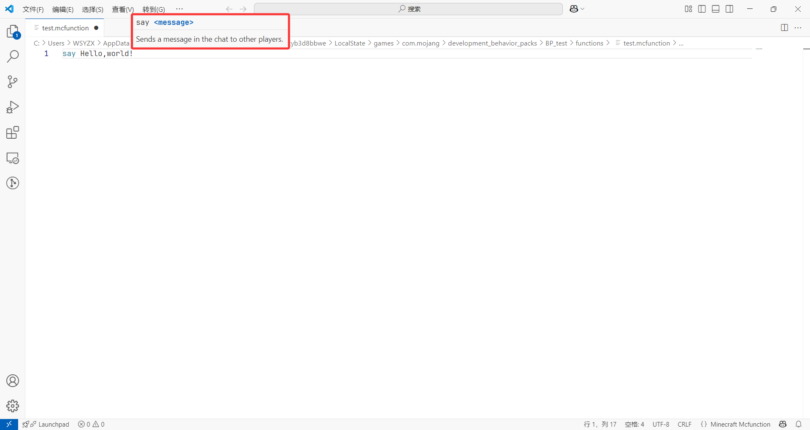

## 调用函数

向函数内写入命令之后该如何调用呢？这里，我们介绍两条执行函数的命令：`/function`和`/schedule`，和一条重载函数的命令`/reload`。

### 直接执行函数文件的命令：`/function`

老规矩，来看这条命令的语法：

```text title="/function的语法"
/function <名称: filepath>
```

执行文件路径为`名称`的函数。要注意，这个文件路径是不包括`functions/`在内的。这个语法还是很简单的！

:::tip[实验 2.1-1]

按照上述步骤新建函数，然后执行下面的命令：

```text
/function test
```

如果包正确安装，游戏内应当有自动补全。

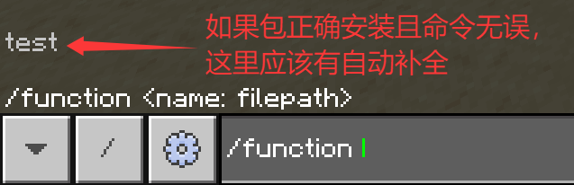

观察执行效果。一定要确保你的包目前是正确安装的！

:::


我们看到，执行这个函数后，便以我们自己的身份运行了这条`/say`命令。有关函数的命令上下文，我们一会儿再强调。

### 队列执行函数文件的命令：`/schedule`

```text title="/schedule的语法"
/schedule clear <函数: filepath>
/schedule delay add <函数: filepath> <时间: int> [replace|append]
/schedule delay add <函数: filepath> <时间: int>D [replace|append]
/schedule delay add <函数: filepath> <时间: int>S [replace|append]
/schedule delay add <函数: filepath> <时间: int>T [replace|append]
/schedule delay clear <函数: filepath>
/schedule on_area_loaded add <起点: x y z> <终点: x y z> <函数: filepath>
/schedule on_area_loaded add circle <中心: x y z> <半径: int> <函数: filepath>
/schedule on_area_loaded add tickingarea <名称: string> <函数: filepath>
/schedule on_area_loaded clear function <函数: filepath>
/schedule on_area_loaded clear tickingarea <名称: string> [函数: filepath]
```

上面这些是`/schedule`的语法。本来，这一部分内容应该是扩展内容，但是 1.21.40 加入的`clear`语法和 1.21.50 加入的`delay`语法则大幅地提升了这条命令的可用性。这条命令可以看到分为 3 种语法：`on_area_loaded`、`clear`（1.21.40+）和`delay`（1.21.50+）。对于`on_area_loaded`和`clear`的用法，请读者结合[命令文档：全部命令汇总](/docs/docs/commands/all_commands#schedule)自行尝试，它们并不是我们这一节的重点（因为也不好用），这里就不再赘述，我们主要强调`delay`的用法。

```text title="/schedule的语法"
/schedule delay add <函数: filepath> <时间: int> [replace|append]
/schedule delay add <函数: filepath> <时间: int>D [replace|append]
/schedule delay add <函数: filepath> <时间: int>S [replace|append]
/schedule delay add <函数: filepath> <时间: int>T [replace|append]
```

这些命令将在`时间`后执行`函数`。其中，`D`、`S`、`T`分别代表的是游戏日、秒和游戏刻，也就是时间的单位，如果不指定就用游戏刻。最后的`replace|append`则是对同一个函数而言的，是取代已有的同名函数还是排列到同名函数之后。

:::tip[实验 2.1-2]

执行下面的命令：

```text
/schedule delay add test 1s
```

观察执行效果。

:::

这条命令的执行效果如下，可以看到该函数在 1 秒钟后，由服务器执行。这是函数延迟执行命令的一个关键方法，在这条命令加入之前，我们都是用记分板控制条件来实现延时的，相比来说就会麻烦不少了。


现在我们再来试一下`[replace|append]`的用途。

:::tip[实验 2.1-3]

**快速**执行下面的两条命令：

```text
/schedule delay add test 10s
/schedule delay add test 10s replace
```

在服务器返回消息后，再**快速**执行下面的两条命令：

```text
/schedule delay add test 10s
/schedule delay add test 10s append
```

分别观察执行效果。

:::

我们看到，使用`replace`就只返回了一次，证明第一次添加的延迟队列被替换，所以只有第二次添加的延迟队列执行。


而`append`模式就返回了两次，代表两次的队列都成功执行。


`replace`是默认值，所以如果有不能替换的需求的话，就要额外指定`append`参数了。

### 重载函数文件的命令：`/reload`

命令方块在更改完成后，它们的更改就会立刻生效。但是，函数保存完毕之后并不会就立刻生效，我们必须使用`/reload`重新加载函数。

:::tip[实验 2.1-4]

将函数文件内的内容更改为下面的内容：

```mcfunction title="BP/functions/test.mcfunction" showLineNumbers
say 1
```

回到游戏，直接执行`/function test`，可以看到游戏仍然返回“Hello,world!”。

然后，执行`/reload`之后再执行`/function test`，此时游戏返回更改后的“1”。

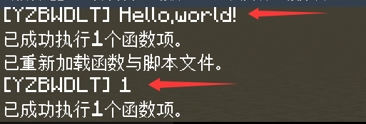

:::

这里再引入以下“小退”和“大退”的概念。众所周知，“重启解决 90% 的问题”，在附加包的编写中，为了应用更改的附加包，我们总是要进行重启操作。在本教程中定义：**“小退”为退出世界重进（更简单一些），而“大退”为退出游戏重进（更复杂一些）**。可以看到，`/reload`已经是应用更改最简单的方法了，但只能应用函数和 SAPI 的更改。通常，小退能够应用大部分的更改。日后我们会频繁地见到这两个概念。

## 函数的命令上下文

我们知道，命令上下文对于一条命令的执行是至关重要的，现在我们要研究一下函数执行的命令上下文。通常，调用一个函数大概可以分为以下几种情况：

- 如果有明显的执行者，那么就直接使用该执行者的上下文。
  - 例如我们自己来执行`/function`命令，那么函数内的所有命令都视为是我们自己执行。例如，如果函数文件写入命令`setblock ~~~ stone`，那么就会在我们自己的位置放置一块石头。  
    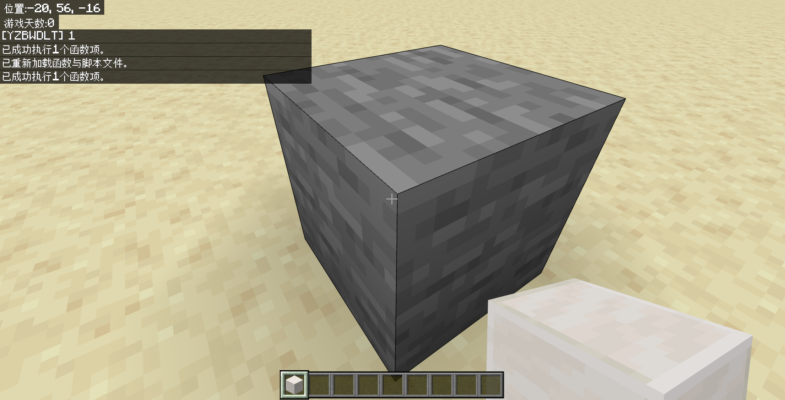
  - 而如果是命令方块执行`/function`命令，那么函数内的所有命令都视为是命令方块执行的。
- 如果是`/schedule`执行，此时是**服务端**直接执行命令。此时的命令上下文分别如下表所示，读者感兴趣的话可以用`/tp`等命令做个实验：

  | 执行者 | 执行位置 | 执行朝向 | 执行维度 |
  | :---: | :---: | :---: | :---: |
  | 无执行者实体，执行者名称为`服务器` | （0,0,0） | （0,0）[^1] | 主世界 |

  稍后我们还会看到一个直接由服务端执行命令的情况。

  [^1]: 在实际测试中（`tp @a ~~~~~`），玩家的朝向并没有更改为（0,0），而是没有更改。该参数有待验证。

## 多命令函数

函数可以等效于一个 CB 链，理所当然地支持多条命令。

:::tip[实验 2.1-6]

将函数文件内的内容更改为下面的内容：

```mcfunction title="BP/functions/test.mcfunction" showLineNumbers
say 1
say 2
say 3
say 4
say 5
```

`/reload`后，执行`/function test`并观察现象。

:::

我们看到执行效果如下图所示。也就是说，**函数中的命令是严格从上到下执行完毕的，和一条无条件的脉冲 CB 链的逻辑是一致的**。


我们再来看一个更复杂的逻辑。

:::tip[实验 2.1-6]

将函数文件内的内容更改为下面的内容：

```mcfunction title="BP/functions/test.mcfunction" showLineNumbers
execute as @a at @s if entity @s[y=~1.6,dy=0.1] run scoreboard players set @s state 0
execute as @a at @s if entity @s[y=~1.3,dy=0.1] unless entity @s[y=~1.6,dy=0.1] run scoreboard players set @s state 1
execute as @a at @s if entity @s[y=~0.5,dy=0.1] unless entity @s[y=~1.3,dy=0.1] run scoreboard players set @s state 2
execute as @a at @s if entity @s[y=~0.1,dy=0.1] unless entity @s[y=~0.5,dy=0.1] run scoreboard players set @s state 3

title @a[scores={state=0}] actionbar 站立中
title @a[scores={state=1}] actionbar 潜行中
title @a[scores={state=2}] actionbar 爬行中
title @a[scores={state=3}] actionbar 睡觉中
```

我们在[模块 1 的 2.4.5](/docs/tutorials/a1_commands/b2_commands/c4_tag_and_scoreboard/d5_applications#检测站立潜行爬行和睡觉的玩家) 中曾经讲过，前 4 行是用来检查玩家的站立状态的，而后 4 行则通过`/title`命令将玩家的状态展现出来。

`/reload`后，在一个 RCB 中写入`function test`并启用，观察现象。

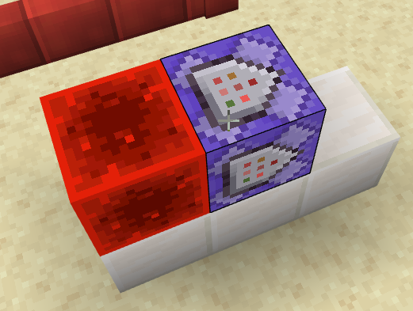

:::

这是上面这些命令的执行效果。可以看到，使用函数就可以把一条长达 8 个 CB 的 CB 链大幅地简化为 1 个 CB。

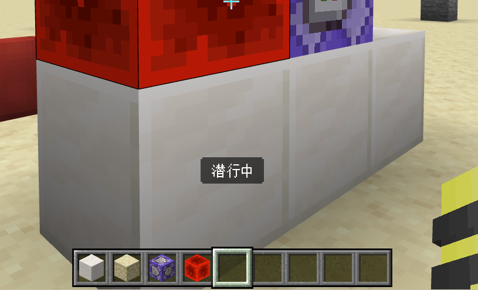

## 注释

对于多命令函数来说，使用注释可以很好地声明复杂函数系统的逻辑，大幅提升函数文件的可读性。

在函数中，我们使用`#`来为函数代码添加一段注释。添加注释需要另起一行，以`#`开头，后面写入的任何内容都不会被游戏解析。例如，我们可以为实验 2.1-6 中的命令按照下面的风格添加注释：

```mcfunction title="BP/functions/test.mcfunction" showLineNumbers {1-3,9}
# ===== 检查玩家状态 =====
# state.@s |  0   1   2   3
# 玩家状态  | 站立 潜行 爬行 睡觉
execute as @a at @s if entity @s[y=~1.6,dy=0.1] run scoreboard players set @s state 0
execute as @a at @s if entity @s[y=~1.3,dy=0.1] unless entity @s[y=~1.6,dy=0.1] run scoreboard players set @s state 1
execute as @a at @s if entity @s[y=~0.5,dy=0.1] unless entity @s[y=~1.3,dy=0.1] run scoreboard players set @s state 2
execute as @a at @s if entity @s[y=~0.1,dy=0.1] unless entity @s[y=~0.5,dy=0.1] run scoreboard players set @s state 3

# ===== 将玩家的状态打印到快捷栏标题上 =====
title @a[scores={state=0}] actionbar 站立中
title @a[scores={state=1}] actionbar 潜行中
title @a[scores={state=2}] actionbar 爬行中
title @a[scores={state=3}] actionbar 睡觉中
```

看，这样的话即使是命令基础不强的开发者，也能轻松地读懂我们的代码逻辑。如果不想写的太花哨的话，即使是简单写几个字也能大幅提高代码的可读性：

```mcfunction title="BP/functions/test.mcfunction" showLineNumbers {1,7}
# 玩家状态
execute as @a at @s if entity @s[y=~1.6,dy=0.1] run scoreboard players set @s state 0
execute as @a at @s if entity @s[y=~1.3,dy=0.1] unless entity @s[y=~1.6,dy=0.1] run scoreboard players set @s state 1
execute as @a at @s if entity @s[y=~0.5,dy=0.1] unless entity @s[y=~1.3,dy=0.1] run scoreboard players set @s state 2
execute as @a at @s if entity @s[y=~0.1,dy=0.1] unless entity @s[y=~0.5,dy=0.1] run scoreboard players set @s state 3

# 打印玩家状态
title @a[scores={state=0}] actionbar 站立中
title @a[scores={state=1}] actionbar 潜行中
title @a[scores={state=2}] actionbar 爬行中
title @a[scores={state=3}] actionbar 睡觉中
```

**我们推荐你在你的函数系统中，常使用注释来添加你的代码的可读性**。常写代码的开发者们都知道，有时候代码写到后面甚至会自己都看不懂……这并不是玩笑话，是一个很神奇而且很常见的事实，所以注释是很重要的。

## 多函数系统

函数也理所当然地支持“多条 CB 链”，也就是多个函数文件。显然，写函数系统的话只有一个函数文件通常都是不够用的，必须使用多个函数来解决复杂逻辑。

:::tip[实验 2.1-7]

在函数文件夹中，新建一个函数文件<FileType type="file" name="diamond.mcfunction" />。此时，你的函数文件路径如下：

<treeview>

- <FileType type="folder" name="functions" />
  - <FileType type="file" name="test.mcfunction" />
  - **<FileType type="file" name="diamond.mcfunction" />**

</treeview>

然后，在<FileType type="file" name="diamond.mcfunction" />中写入下面的内容：

```mcfunction showLineNumbers title="diamond.mcfunction"
give @a diamond 64
execute as @a at @s run setblock ~~-1~ diamond_block
```

`/reload`后，执行`/function diamond`，观察执行效果。

:::

执行后，我们得到 64 颗钻石，以及在脚下放置了 1 个钻石块。看，创建“另一条 CB 链”也是如此简单！

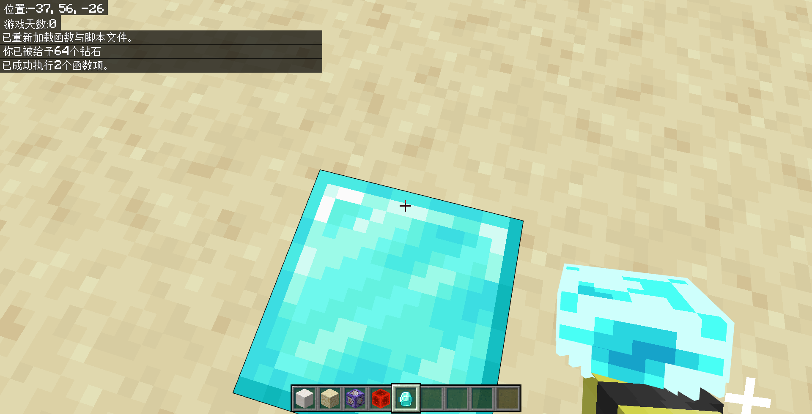

### 套用在文件夹内的函数

对于一些逻辑十分复杂的地图来说，如果把函数文件全部放在根目录中，到最后很可能会多到难以查找，带来很大的不便。这时，我们可以将函数按照其功能分类。

:::tip[实验 2.1-8]

在函数文件夹中，新建一个文件夹<FileType type="folder" name="lib" />，在很多领域的实际工程中，lib 代表的是 Library（库），代表其中内含了很多经常调用的方法。这里，我们来向这个 lib 文件夹中插入一个检查玩家数量的方法。

在<FileType type="folder" name="lib" />中创建一个函数文件<FileType type="file" name="get_player_amount.mcfunction" />。此时，你的函数文件路径如下：

<treeview>

- <FileType type="folder" name="functions" />
  - **<FileType type="folder" name="lib" />**
    - **<FileType type="file" name="get_player_amount.mcfunction" />**
  - <FileType type="file" name="test.mcfunction" />
  - <FileType type="file" name="diamond.mcfunction" />

</treeview>

然后，在<FileType type="file" name="get_player_amount.mcfunction" />中写入下面的内容：

```mcfunction showLineNumbers title="lib/get_player_amount.mcfunction"
# ===== 获取玩家数量 =====
scoreboard players set playerAmount data 0
execute as @a run scoreboard players add playerAmount data 1
```

`/reload`后，执行`/function lib/get_player_amount`，观察执行效果。

:::

我们看到，只需要调用一次这个函数，在记分板上就能够输出玩家数量，还是很好用的。

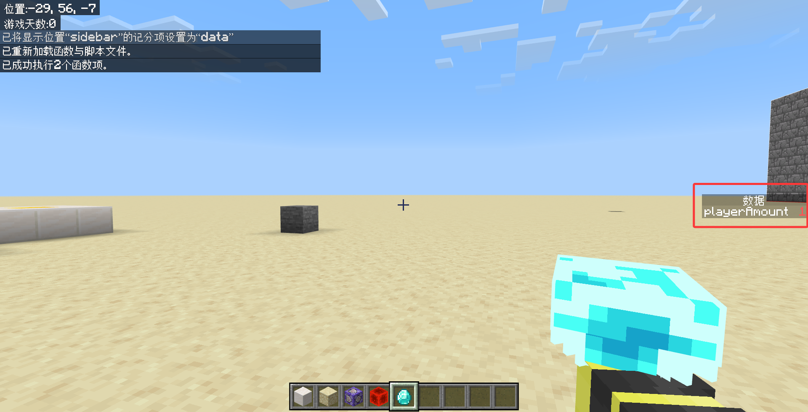

但我们这里要讲到的重点，是套在文件夹内的函数调用方法，也就是**写入除`functions/`外的路径后，再写入除后缀名的文件名**。例如：

<treeview>

- <FileType type="folder" name="functions" />
  - <FileType type="folder" name="foo" />
    - <FileType type="folder" name="foo1" />
      - <FileType type="file" name="example.mcfunction" />

</treeview>

那么，调用<FileType type="file" name="example.mcfunction" />，就可以用`/function foo/foo1/example`。

### 函数调用函数

刚刚我们说，函数的地位和一个无条件的 CB 链是等同的。既然命令方块能执行函数，那么函数理论上也能执行函数了？既然这样，我们不妨一试。

:::tip[实验 2.1-8]

在函数文件夹中，新建一个函数文件<FileType type="file" name="test2.mcfunction" />。此时，你的函数文件路径如下：

<treeview>

- <FileType type="folder" name="functions" />
  - <FileType type="folder" name="lib" />
    - <FileType type="file" name="get_player_amount.mcfunction" />
  - <FileType type="file" name="test.mcfunction" />
  - **<FileType type="file" name="test2.mcfunction" />**
  - <FileType type="file" name="diamond.mcfunction" />

</treeview>

然后，在<FileType type="file" name="test.mcfunction" />中写入下面的内容：

```mcfunction showLineNumbers title="test.mcfunction"
say 1
say 2
say 3
function test2
```

在<FileType type="file" name="test2.mcfunction" />中写入下面的内容：

```mcfunction showLineNumbers title="test2.mcfunction"
say 4
say 5
say 6
```

`/reload`后，执行`/function test`，观察执行效果。

:::

执行后的效果如下图。可以看到，在返回了“1”“2”“3”之后，就执行到`test2`上面，继续返回“4”“5”“6”。但是，游戏显示一共执行了 7 条命令，代表`/function`本身也需要一条命令，终究会消耗一点性能。


现在，我们需要研究一下函数执行的顺序问题。我们知道，函数和 CB 链都是瞬时执行命令的，但是在调用其他 CB 链（调用其他函数）的时候，就存在执行顺序问题了。我们来做一个小实验，来了解一下二者的调用顺序问题。

:::tip[实验 2.1-9]

将<FileType type="file" name="test.mcfunction" />中改为下面的内容（将第 3-4 行调换）：

```mcfunction showLineNumbers title="test.mcfunction" {3-4}
say 1
say 2
function test2
say 3
```

`/reload`后，执行`/function test`，观察执行效果。

然后，使用同样的两个 CB 链，写入同样的命令，观察执行效果。

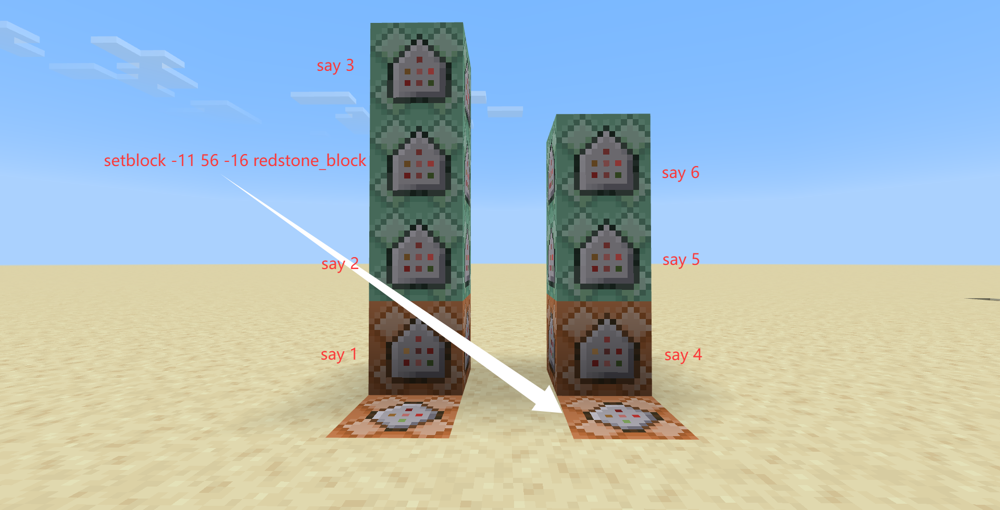

:::

我们看到两种执行效果分别如下。

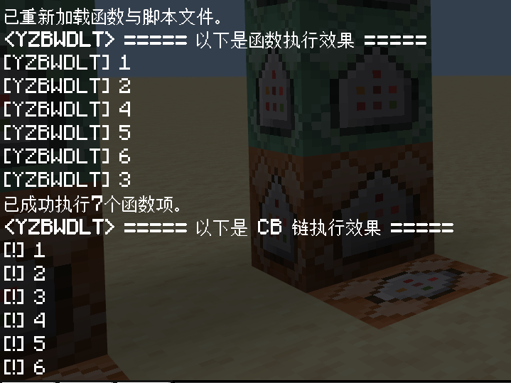

这个结果是很有意义的，**它直接为我们揭示了传统的 CB 链调用和函数调用顺序的一个本质区别**。

对于函数调用的情况，在执行了“1”和“2”之后，会立刻执行`test2`里面的内容，在“4”“5”“6”执行完毕之后再回到`test`中继续执行“3”，这个过程，可以用下面的图来表示。

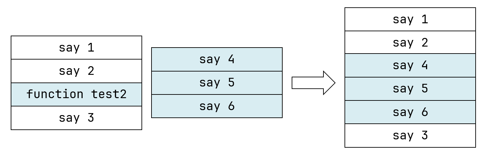

这叫做**深度优先原则**，在遇到一个更深层逻辑的时候，会先将这个逻辑处理完毕，然后再处理浅层逻辑。例如在这里，`test2`就是一个更深层的逻辑，所以先处理这其中的所有命令，再回到`test`这个浅层逻辑。

而 CB 链调用的情况，则是先执行了本链中的“1”“2”“3”再执行了“4”“5”“6”。这个过程则可以由下图表示。

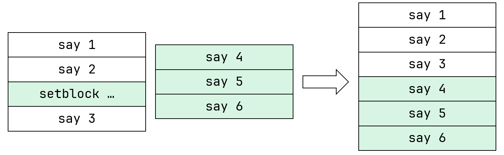

这叫做**广度优先原则**，在遇到一个更深层逻辑的时候，会先暂时搁置，把浅层逻辑处理完毕之后再处理深层逻辑。例如在这里，第二条 CB 链（相当于`test2`）是一个更深层的逻辑，所以先处理第一条 CB 链（相当于`test`）这个浅层逻辑的所有其他内容，再处理深层逻辑。

所以，CB 链调用和函数调用所采用的执行逻辑是很不一样的。而且，CB 链调用的时候会因为红石系统本身的延迟问题，执行深层逻辑的时候会带来一些延迟，这可能会为我们的逻辑执行带来不确定性，尤其是在当时讲到 [RCB 链的内部延迟](/docs/tutorials/a1_commands/b3_command_systems/c2_command_block#cb-链上的延迟表现)时，我们已看到了这种不确定性是很难把控的。某种意义上，**这可能也是函数的一个优势——在执行顺序上，函数是高度确定的（尤其是循环执行时）**。

:::info[思考 2.1-1]

在有需求的情况下，如何用函数实现类似于 CB 链调用的效果呢？

<details>

<summary>答案（思考过后再翻看哦~）</summary>

将`function test2`改为`schedule delay add test2 1t`即可。

</details>

:::

其实，深度优先原则还体现在命令`/execute`上。在讲这条命令的时候，因为讲这个稍微有些复杂，所以我们就没有讲。读者可以查看[命令/execute - 中文 Minecraft Wiki](https://zh.minecraft.wiki/w/命令/execute#执行分支) 了解更多。

### 递归

既然函数可以调用其他函数，能否调用自己呢？我们来试验一下：

:::tip[实验 2.1-10]

将<FileType type="file" name="test.mcfunction" />中改为下面的内容：

```mcfunction showLineNumbers title="test.mcfunction" {3-4}
say 1
function test
```

`/reload`后，执行`/function test`，观察执行效果。

:::

命令的执行效果如下。

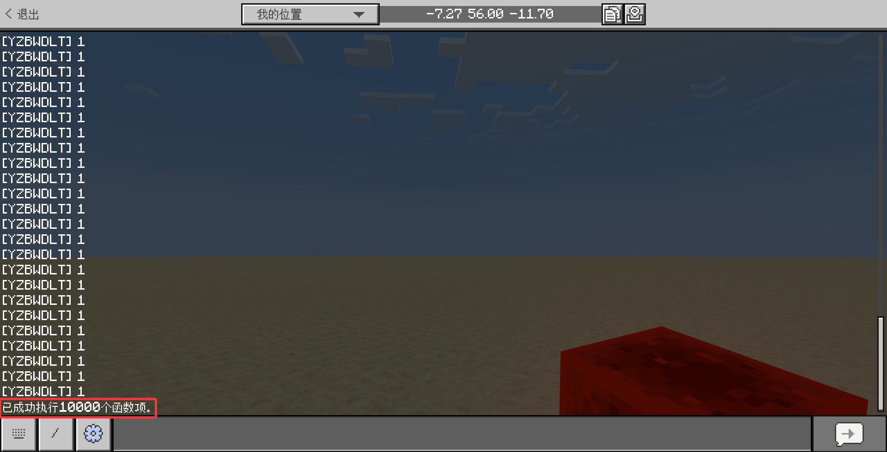

我们看到，这里是变相地实现了循环执行的。但是，这个循环会在 10000 次循环后终止。能不能改变这个值呢？其实是可以的，我们可以用`/gamerule functionCommandLimit <值>`来控制函数执行命令的上限，然而很遗憾，这个值最大值就是 10000，不能设置为`maxCommandChainLength`那么大的值（比如 65535）。

而且，读者可以发现这 10000 次执行，即使是`/say`和`/function`瞬间执行 10000 次也带来了大量的卡顿，所以通常情况下，10000 条命令应该都是足够的（*毕竟同时执行 10000 条命令换谁都卡，基本可以认为没有任何可用性可言，连网易的盲审都难过*）。我们也不用调用函数自己的方法来实现循环。

这种函数调用自身的行为，在编程领域中有个专门的名词，叫做**递归（Recursive）**。递归在不设置条件的情况下，会带来大量的卡顿，有时可能会直接令程序在递归处完全锁死，无法执行其他代码。然而，在设置了退出条件的情况下，却往往有其独特意义。

> 一种计算过程，**如果其中每一步都要用到前一步或前几步的结果**，称为递归。用递归过程定义的函数，称为递归函数，例如连加、连乘及阶乘等。凡是递归的函数，都是可计算的，即能行的。  
> —— 百度百科

我们来试一下使用命令系统直接实现阶乘的计算。以防读者不清楚，x 的阶乘在数学上定义为 x! = x·(x-1)·(x-2)·...·3·2·1。

:::tip[实验 2.1-11]

我们先考虑如何实现 x 的阶乘。假设传入一个变量`data.x`，我们先设定一个结果变量`data.result`。

然后，先将`data.result`设置为`data.x`的值，此时 result=x，然后令`data.x`自减，再进行乘法操作，此时 result=x·(x-1)。然后，不断循环，因为逻辑是完全一致的，所以需要用到递归。

退出条件，就看`data.x`什么时候减为 0，换言之，在没有减到 0 之前一直递归。

有了思路之后，我们开始进行命令的编写。在<FileType type="folder" name="lib" />中创建一个函数文件<FileType type="file" name="get_factorial.mcfunction" />：

<treeview>

- <FileType type="folder" name="functions" />
  - <FileType type="folder" name="lib" />
    - <FileType type="file" name="get_player_amount.mcfunction" />
    - **<FileType type="file" name="get_factorial.mcfunction" />**
  - <FileType type="file" name="test.mcfunction" />
  - <FileType type="file" name="test2.mcfunction" />
  - <FileType type="file" name="diamond.mcfunction" />

</treeview>

在<FileType type="file" name="get_factorial.mcfunction" />中写入下列内容：

```mcfunction showLineNumbers title="lib/get_factorial.mcfunction"
# ===== 获取阶乘 =====
# 输入临时变量data.funcInput，输出data.funcInput的阶乘到data.result。

## 计算阶乘
scoreboard players operation result data *= funcInput data
scoreboard players remove funcInput data 1

## 当data.funcInput>=1时，继续递归
execute if score funcInput data matches 1.. run function lib/get_factorial

## 当data.funcInput<=0时，结束递归并移除临时变量
execute if score funcInput data matches ..0 run scoreboard players reset funcInput data

```

读者应当可以看懂上面代码的含义。这里使用`data.funcInput`，是特意为不影响原数据而做的额外措施。然后，我们需要先进行变量的初始化，然后调用该函数，相当于向该函数内传入变量。

```mcfunction showLineNumbers title="test.mcfunction"
# 变量初始化并调用函数
scoreboard players set x data 10
scoreboard players set result data 1
## 备份data.x（防止原数据被更改）
scoreboard players operation funcInput data = x data
function lib/get_factorial

# 打印变量
tellraw @a {"rawtext":[{"translate":"%%s的阶乘等于%%s","with":{"rawtext":[{"score":{"objective":"data","name":"x"}},{"score":{"objective":"data","name":"result"}}]}}]}
```

执行`/function test`，观察执行结果。

:::

这样，我们就能得到 10! = 3628800 了。

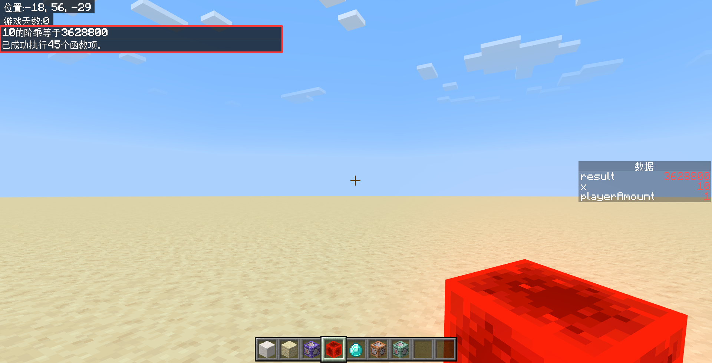

### 使用 VSC 打开附加包文件夹

到现在为止，我们已经创建了 5 个函数文件。如果每次我们编辑查看各个函数，都要打开文件资源管理器并双击打开函数的话，也是很不方便的。然而，我们可以用一个非常简单的方法快捷管理文件夹的文件，也就是**用 VSC 直接打开附加包的文件夹**。步骤也很简单：

1. 新开一个 VSC 窗口，以及在文件管理器中找到我们的行为包：
    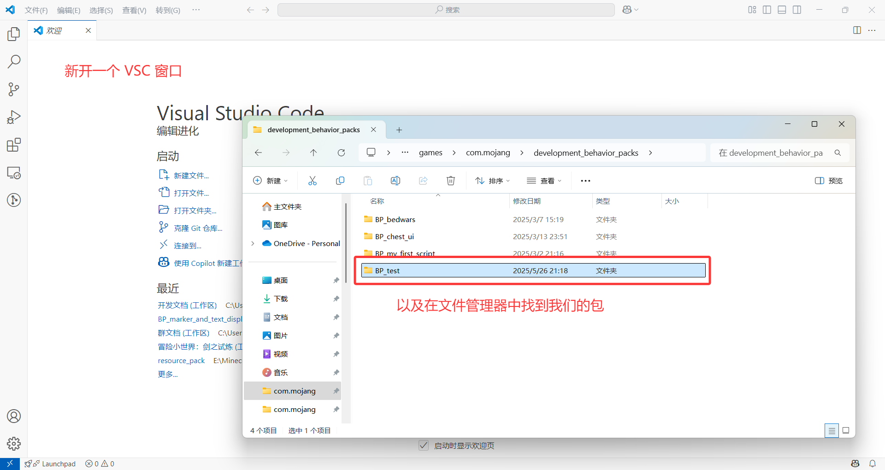
2. 然后，点开 VSC 左侧第一个按钮，打开文件管理器界面，将我们的行为包拖进去：
    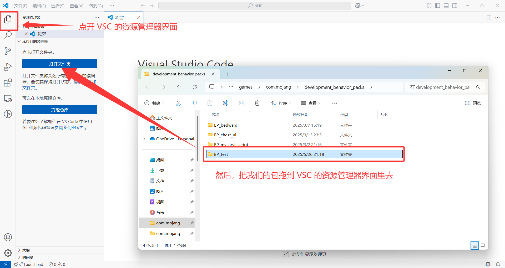
3. 为日后使用 VSC 方便，将我们的工作区直接保存：
    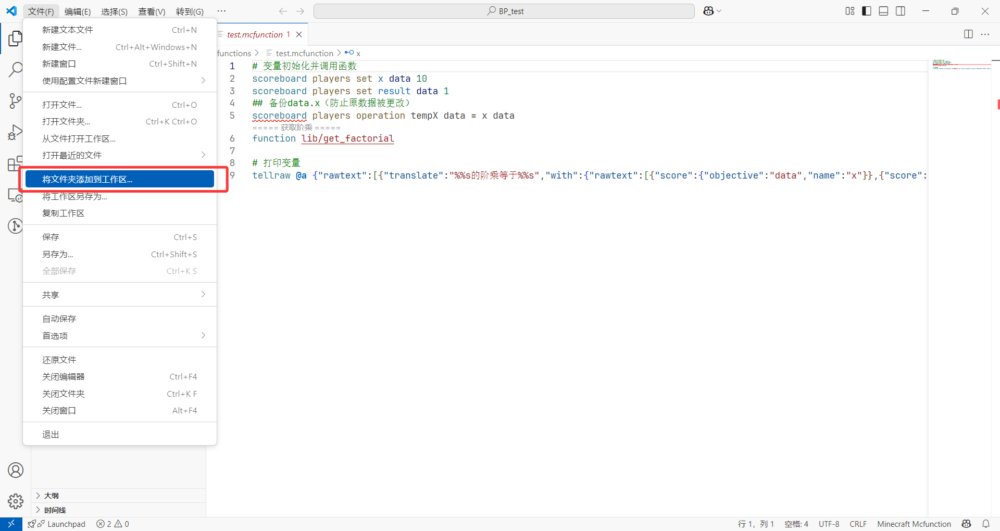  
      
    日后，双击该工作区文件即可快速打开我们上次的编辑。

**这样做的好处非常多，可以说这是我们充分利用 VSC 编辑优势的关键**。

- 第一，VSC 的文件管理器可以折叠展开多个文件夹，可以专门打开我们所需要的文件，方便我们进行文件编辑和查找。
  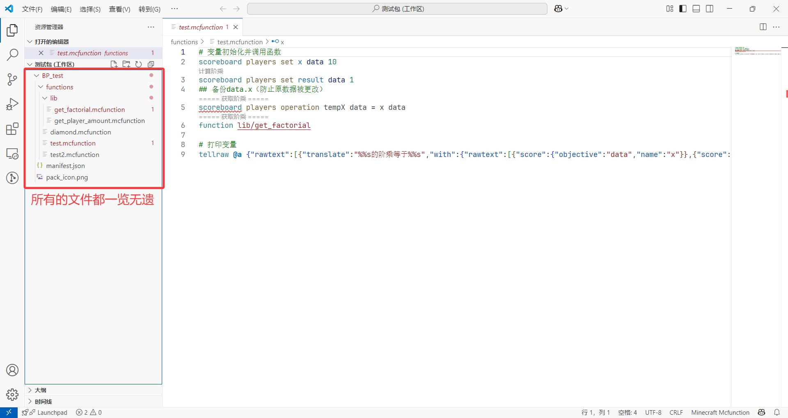
- 第二，我们可以通过左侧的第二个按钮，也就是查找替换来进行全局的查找替换，高效地找到我们要找的关键字。
  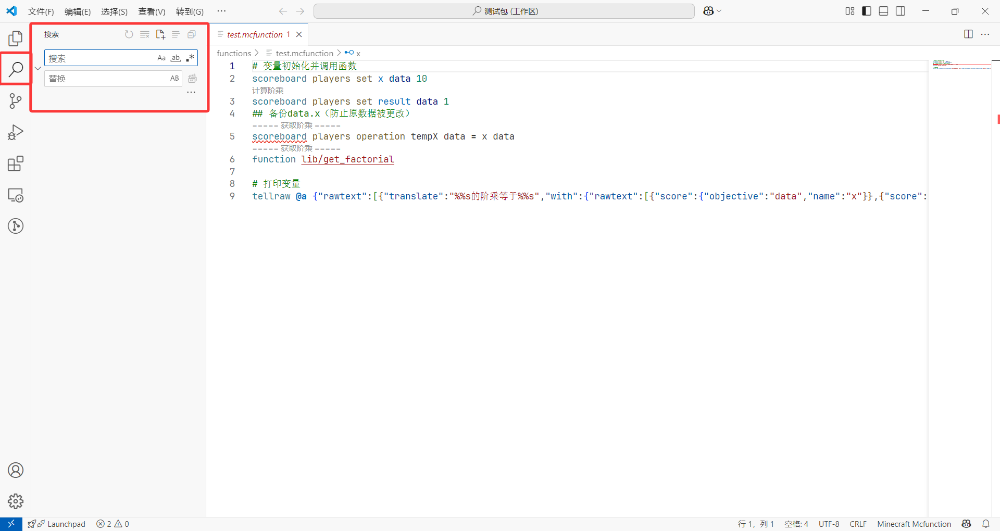
- 第三，我们在第一章安装的两个插件可以更好地成体系运行，可以直接基于我们的项目，综合进行检查和自动补全。
  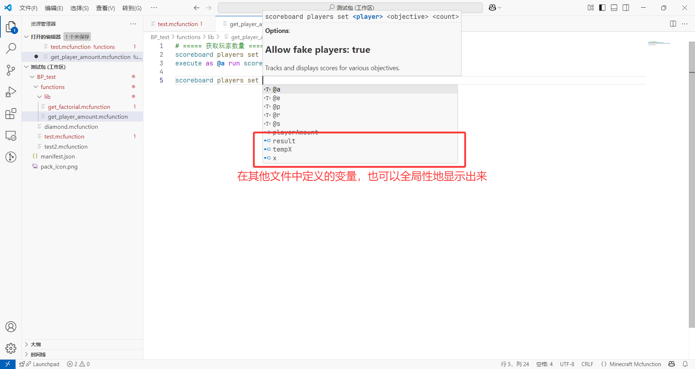  
  尤其是在和自定义方块、物品、实体联动的时候，甚至可以对这些内容进行自动补全，十分强大。
  - 我们还可以在函数文件内，鼠标指向`function`命令写入的文件路径，使用<kbd>Ctrl</kbd>+<kbd>鼠标左键</kbd>快速跳转到对应函数，非常方便。  
    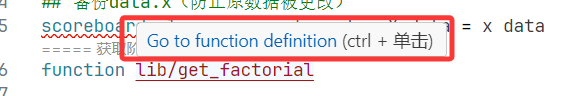  

要使用 VSC 新建文件或文件夹也是很简单的。只需要在文件管理器中使用这两个小按钮即可解决。

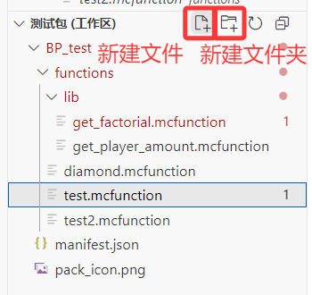

但是，美中不足的是，有时候我们安装的两个插件有可能会因为一些 bug 而判断出错。例如上图中，插件就对我们的`/scoreboard`命令报错，我们将鼠标指向红色波浪线（也就是报错的位置）处：

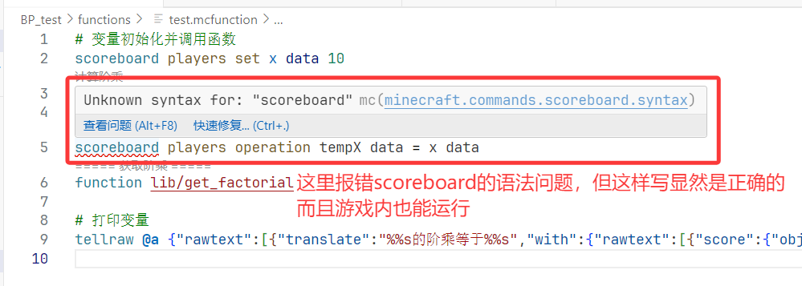

如果你有信心保证你的写法是正确的，那么就可以点击报错处底下的“快速修复（Ctrl+.）”，然后选择忽略相关的错误检查：

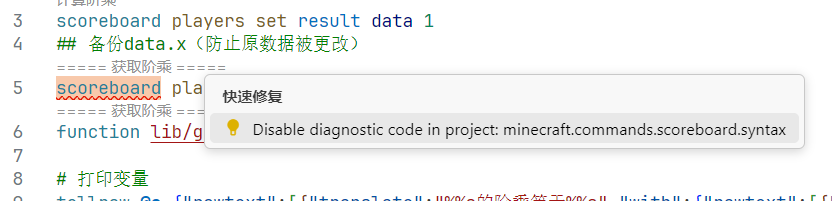

这里 VSC 会自动创建一个`.mcattributes`文件，我们保存之，然后重启 VSC，就不会再在这里报错了。

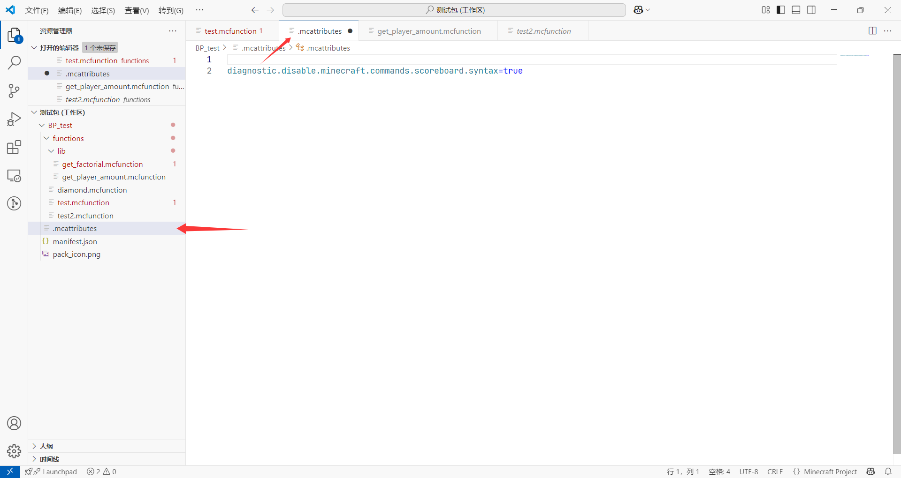  
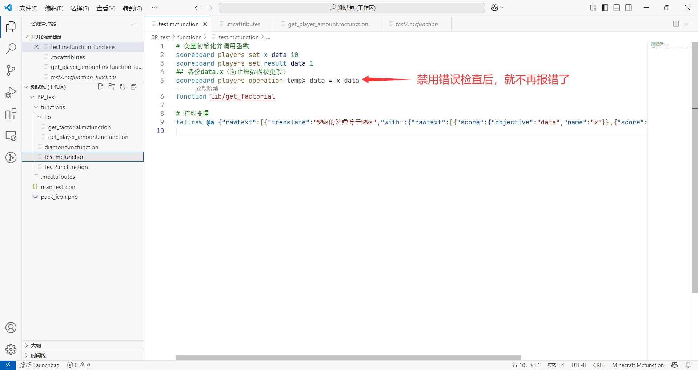

### 循环执行函数

似乎直到这里，我们还没有办法完全脱离命令方块运行命令。有没有什么办法可以 100% 附加包运行命令呢？

嗯，有的兄弟，有的。

:::tip[实验 2.1-12]

我们在<FileType type="folder" name="functions" />根目录中创建一个 JSON 文件<FileType type="file" name="tick.json" />：

<treeview>

- <FileType type="folder" name="functions" />
  - <FileType type="folder" name="lib" />
    - <FileType type="file" name="get_player_amount.mcfunction" />
    - <FileType type="file" name="get_factorial.mcfunction" />
  - <FileType type="file" name="test.mcfunction" />
  - <FileType type="file" name="test2.mcfunction" />
  - <FileType type="file" name="diamond.mcfunction" />
  - **<FileType type="file" name="tick.json" />**

</treeview>

向<FileType type="file" name="tick.json" />中写入以下内容：

```json title="tick.json" showLineNumber
{
    "values": [
        "test"
    ]
}
```

然后把<FileType type="file" name="test.mcfunction" />的内容改为：

```mcfunction showLineNumbers title="test.mcfunction"
scoreboard players add tick time 1
execute if score tick time matches 20.. run scoreboard players remove tick time 20
```

在`/reload`之后（这里不需要小退或大退），观察`time`记分板的值。

:::

最后，你会发现`time.tick`变量在`0`~`19`之间循环。


原理就是，**<FileType type="file" name="tick.json" />所指定的函数会每游戏刻无条件地执行一次**。在上面的例子中，<FileType type="file" name="tick.json" />就指定了<FileType type="file" name="test.mcfunction" />为始终执行的函数。

借助<FileType type="file" name="tick.json" />，我们可以做到一张地图内部完全没有命令方块，仅凭函数就可以构建一整套完整的逻辑。这种地图，我个人通常称之为“全函数地图”。这种地图能够带来一些显著优势，例如和一款广泛被应用的代码仓库存储软件 Git 进行联动应用时，它可以做到地图内饰与命令的完全分离，当地图因`/fill`、`/clone`等意外被损毁时，命令部分可以丝毫不受影响，而只回退受影响的地图内饰部分。好处有很多，前文已经系统总结过一些，读者感兴趣可以体验一下。

## 函数相对于命令方块的劣势及其解决方法

既然函数相比于命令方块有这么多优点，那函数有没有什么缺点呢？其实也是有的，凡事总要具有两面性。

- 首先可以看到函数的门槛比较高，因为要使用附加包，而附加包通常需要文件管理、以及 JSON 语法的基础，这就要求我们打好这些基础，才能较好地应用它们；
- 此外，函数在延时执行、条件执行等方面上有时并没有命令方块来得方便；
  - 对于延时执行问题，我们通常采取的方案是利用记分板计时器，就是令<FileType type="file" name="tick.json" />执行一个计时器文件（或者令<FileType type="file" name="tick.json" />执行一个主文件，再由主文件执行一个计时器文件），在需要的时候使这个计时器循环执行，通过加减变量的分值（我个人常使用`time.timeline`这个变量）和变量的检测来执行延时命令。例如：
    <!--markdownlint-disable MD031-->
    ```mcfunction showLineNumbers title="main.mcfunction"
    scoreboard players add timeline time 1
    execute if score timeline time matches 20 run say 这是第一秒！
    execute if score timeline time matches 40 run say 这是第二秒！
    execute if score timeline time matches 60 run say 这是第三秒！
    ```
  - 或者，在更高版本下，用`/schedule`也是一种不错的选择，但是要注意使用该命令可能遇到的时序问题。
  - 对于条件检测问题，在 1.19.50 的`/execute`更新之后，这方面的问题已经得到了极大的改善，但不可否认的是命令的执行效果依然是无法获取的（例如`/enchant`或`/clear` 0 个物品），所以我们需要尽可能通过逻辑去弥补这一方面的不足，当然实践证明需要获取命令是否成功执行的情况是很少的，通常使用`/execute if|unless`就能够解决我们的绝大多数问题。
- 以及函数成也空间败也空间，在检查空间内的实体、方块等信息的时候会有额外的麻烦。
  - 这方面，就需要善用`/execute if|unless block|blocks|entity`了。

但总的来说，函数可以实现命令系统的进一步升级和编写效率上的全面提高，读者可以在一个个的函数编写中慢慢地了解到这一点。

## 为函数引入一个命名空间

在很多情况下，我们的函数可能不可避免地和别人写的函数冲突，毕竟合适的英文单词就那么几个。那该怎么办呢？我们可以为我们自己的函数加上一个**命名空间（Namespace）**，以防和别人的冲突！

什么叫命名空间？基本上可以理解为，命名空间是我们防止和其他人的包产生冲突的基本手段。命名空间的概念在附加包中有着广泛的应用，例如铜锭的 ID 是`copper_ingot`，但是它的更完整的 ID 应该是`minecraft:copper_ingot`，其中冒号左边的`minecraft`代表是游戏自身加入的物品。如果你也要加一种铜锭呢？那就命名为`my_project:copper_ingot`，其中左边的命名空间可以自定义，比如在我的地图中，就用过`wstd`、`aw`这样的命名空间。通常为了防止和别人的包重复，还可以更复杂一点，比如`bedwars`作为命名空间就很容易和别人的起床战争类似模组冲突（虽然一般情况下也不会有人安装 2 个起床战争模组吧？），但我们也可以写成`yzbwdlt_bedwars`（也就是加上自己的名字）以防止和别人的模组冲突。

那么，函数该怎么引入一个命名空间呢？其实很简单，我们只需要在最外层套上一个命名空间文件夹就好了。例如现在我们在做一张起床战争地图，我们原来的函数文件架构可能是：

<treeview>

- <FileType type="folder" name="functions" />
  - <FileType type="folder" name="entities" />
    - ...
  - <FileType type="folder" name="game" />
    - ...
  - <FileType type="folder" name="items" />
    - ...
  - <FileType type="folder" name="lib" />
    - ...
  - <FileType type="folder" name="system" />
    - ...
  - **<FileType type="file" name="tick.json" />**

</treeview>

那么，我们引入一个命名空间`yzbwdlt_bedwars`，就为

<treeview>

- <FileType type="folder" name="functions" />
  - **<FileType type="folder" name="yzbwdlt_bedwars" />：我们引入的命名空间文件夹**
    - <FileType type="folder" name="entities" />
      - ...
    - <FileType type="folder" name="game" />
      - ...
    - <FileType type="folder" name="items" />
      - ...
    - <FileType type="folder" name="lib" />
      - ...
    - <FileType type="folder" name="system" />
      - ...
  - **<FileType type="file" name="tick.json" />**

</treeview>

这样，我们就能有效地防止我们自己的包和别人的包产生冲突了。

---

## 总结

在本节，我们学习了函数系统及其使用方法。一起来回顾一下吧！

- 函数（Function）：是一种用于在被调用时，按顺序执行文件中写入的命令的文件
- 使用函数的优势：可见性强、编辑优势明显、支持更长的注释、空间影响低、支持旧语法等……
- 创建函数
  - 在行为包根目录中创建一个名为<FileType type="folder" name="functions" />的文件夹，并在其中创建一个后缀为 .mcfunction 的文件，这就是函数文件
  - 执行函数的时候，从上到下依次执行每一行命令，和无条件的 CB 链的执行效果一致，命令的开头不允许带斜杠
  - 开头为 # 的一行是注释，不会被读取，注释不能写到命令的后面，实际工程中推荐使用注释增加代码易读性
  - 在<FileType type="folder" name="functions" />内部可以创建新的函数文件和文件夹，名字不宜过长
  - 在实际工程中，建议引入一个命名空间以防止和其他地图产生冲突
- 调用函数
  - 函数有 2 种调用方式：使用`/function`命令直接调用、使用`/schedule`命令延迟或在特定位置调用
  - 函数内命令上下文，取决于是谁调用了这个函数
    - 如果是玩家调用的，则命令上下文为玩家的命令上下文
    - 如果是服务器调用的（例如<FileType type="file" name="tick.json" />），则命令上下文为：执行者为空、执行位置为（0, 0, 0），执行朝向为（0, 0），执行维度为主世界
    - 如果在测试时，玩家调用函数的效果和服务器调用函数的效果不一致，则可以排查命令上下文相关的问题
  - 修改了函数之后，不必小退或大退重新加载函数，只需要使用`/reload`重载函数即可
  - 函数可以调用其他函数，符合深度优先原则；调用自身时成为递归（不过这种操作很消耗性能）
  - 通过函数最多可以在 1 游戏刻内执行 10000 条命令，这可以通过`/gamerule`来调整
  - 通过<FileType type="file" name="tick.json" />可以每 1 游戏刻执行一次函数，达到循环执行的目的，也可以使得整张地图无 CB 化
- 使用合适的工具简化工作
  - 灵活使用 VSC 的两个插件，借助自动补全功能编写函数可以大幅减少工作量
  - 使用 VSC 打开一整个文件夹，以实现文件之间的协调联动
  - 对于 VSC 插件报错的情况，务必不要被其可能出现的错误的报错迷惑，在确信自己是正确的情况下使用“快速修复”的功能忽略错误的检查

:::info[练习 2.1]

虽然在本节我们并没有强调利用函数写命令系统的事情，不过目前读者理论上是完全有能力完成这个任务的，因为无非也就是将模块 1 中的逻辑通过另一种方法实现而已。下面布置一些练习题，愿读者积极完成。

在此之前，先在你的函数文件夹内创建一个<FileType type="folder" name="system" />，并创建一个<FileType type="file" name="main.mcfunction" />，使该函数在<FileType type="file" name="tick.json" />中循环执行，我们现在给这个文件起名为主文件。把除了<FileType type="file" name="tick.json" />和<FileType type="file" name="main.mcfunction" />之外的文件全部删除，现在你的文件路径应该长这样：

<treeview>

- <FileType type="folder" name="functions" />
  - <FileType type="folder" name="lib" />
  - <FileType type="folder" name="system" />
    - **<FileType type="file" name="main.mcfunction" />**：主文件
  - <FileType type="file" name="tick.json" />

</treeview>

现在你可以开始练习了！下面的题目中在编写命令过后请在游戏内实战尝试效果。注意后面的题目中，不要更改<FileType type="file" name="tick.json" />。

1. 新建一个函数`lib/get_data/player_amount`，在函数内编写命令，使得在调用该函数时，可以将玩家数打印到`data.playerAmount`上。
2. 新建一个函数`system/player_die`，使该函数循环执行，并在函数内编写命令，使得其可以将玩家死亡状态打印到`deathState.@s`上。注：玩家在未死亡时，在`deathState`记分项上的分数应为`0`；刚刚死亡的一瞬间改为`1`；长时间死亡后改为`2`。
3. 在上一题的基础上，更改上面的函数，使得刚刚死亡的玩家执行`lib/events/player_die`，并使玩家在`deathCount.@s`上增加 1 分。这就是基于函数系统的死亡榜。
4. 新建一个函数`system/player_join`，使该函数循环执行，并在函数内编写命令，使得退出重进的玩家执行`lib/events/player_join`的命令。在`lib/events/player_join`内指定命令`tp @s 0 0 0`，并退出游戏重进，检查你是否被正确地传送到该位置。
5. 我们在[模块 1 的 2.4.1](/docs/tutorials/a1_commands/b2_commands/c4_tag_and_scoreboard/d1_tag#目标选择器参数tag) 中曾经介绍过，读者可以利用函数简化命令逻辑：

    > ```mcfunction showLineNumbers
    > tag @a remove glassBelow
    > execute as @a at @s if block ~~-1~ glass if block ~~-2~ glass if block ~~-3~ glass if block ~~-4~ glass if block ~~-5~ glass run tag @s add glassBelow
    > execute as @a[tag=glassBelow] run say 1
    > execute as @a[tag=glassBelow] run say 2
    > execute as @a[tag=glassBelow] run say 3
    > execute as @a[tag=glassBelow] run say 4
    > execute as @a[tag=glassBelow] run say 5
    > ```
    >
    > 在这里，我们用`glassBelow`标签来表示玩家脚下有玻璃。
    >
    > ……
    >
    > 之后，在模块 2 学习函数的时候，你可以了解到一种更简单的执行方式。

    假设现在我们在函数`game/game_1/timeline`中处理该主要逻辑，并使该函数循环执行，更改第 3\~7 行，改为当玩家有标签`glassBelow`时，执行`game/game_1/events/step_on_glass`函数。给出这个简化逻辑，试分析将一个函数拆成这样的两个函数有什么利弊？

:::

<details>

<summary>练习题答案</summary>

1. 命令如下：

    ```mcfunction showLineNumbers title="lib/get_data/player_amount"
    # 获取玩家数
    scoreboard players set playerAmount data 0
    execute as @a run scoreboard players add playerAmount data 1
    ```

2. 命令如下：

    ```mcfunction showLineNumbers title="system/main"
    # 主文件
    function system/player_die
    ```

    ```mcfunction showLineNumbers title="system/player_die"
    # 系统 | 返回玩家死亡状态
    scoreboard players set @a[scores={deathState=!2}] deathState 1
    scoreboard players set @e[type=player] deathState 0
    scoreboard players set @a[scores={deathState=1}] deathState 2
    ```

3. 命令如下：

    ```mcfunction showLineNumbers title="system/player_die" {3}
    # 系统 | 返回玩家死亡状态
    scoreboard players set @a[scores={deathState=!2}] deathState 1
    scoreboard players set @e[type=player] deathState 0
    execute as @a[scores={deathState=1}] at @s run function lib/events/player_die
    scoreboard players set @a[scores={deathState=1}] deathState 2
    ```

    ```mcfunction showLineNumbers title="lib/events/player_die"
    # 当玩家死亡时执行
    scoreboard players add @s deathCount 1
    ```

4. 命令如下：

    ```mcfunction showLineNumbers title="system/main" {3}
    # 主文件
    function system/player_die
    function system/player_join
    ```

    ```mcfunction showLineNumbers title="system/player_join"
    # 系统 | 退出重进系统检测
    scoreboard players add @a isOnline 0
    execute as @a[scores={isOnline=0}] at @s run function aw/lib/events/player_join
    scoreboard objectives remove isOnline
    scoreboard objectives add isOnline dummy "在线数据"
    scoreboard players set @a isOnline 1
    ```

    ```mcfunction showLineNumbers title="lib/events/player_join"
    # 当玩家重新进入游戏时执行
    tp @s 0 0 0
    ```

5. 命令如下：

    ```mcfunction showLineNumbers title="system/main" {4-5}
    # 主文件
    function system/player_die
    function system/player_join
    ## 游戏函数
    function game/game_1/timeline
    ```

    ```mcfunction showLineNumbers title="game/game_1/timeline"
    tag @a remove glassBelow
    execute as @a at @s if block ~~-1~ glass if block ~~-2~ glass if block ~~-3~ glass if block ~~-4~ glass if block ~~-5~ glass run tag @s add glassBelow
    execute as @a[tag=glassBelow] at @s run function game/game_1/events/step_on_glass
    ```

    ```mcfunction showLineNumbers title="game/game_1/events/step_on_glass"
    # 当玩家脚下 5 格均为玻璃时执行
    say 1
    say 2
    say 3
    say 4
    say 5
    ```

    相比起

    ```mcfunction showLineNumbers title="game/game_1/timeline" {3-7}
    tag @a remove glassBelow
    execute as @a at @s if block ~~-1~ glass if block ~~-2~ glass if block ~~-3~ glass if block ~~-4~ glass if block ~~-5~ glass run tag @s add glassBelow
    execute as @a[tag=glassBelow] at @s run say 1
    execute as @a[tag=glassBelow] at @s run say 2
    execute as @a[tag=glassBelow] at @s run say 3
    execute as @a[tag=glassBelow] at @s run say 4
    execute as @a[tag=glassBelow] at @s run say 5
    ```

    读者是否体会到这种差别？优势有以下几点：

    - 从优化角度上看，当不符合条件时，只有 3 条命令被执行，而符合条件时，一共有 8 条命令会执行。虽然在符合条件时，执行的命令数比原来多了一条，但是如果不符合条件的情况占多数的话，那么这种执行方法的优化反而是更好的。
    - 从逻辑角度上看，这样写的逻辑更加清晰。从`timeline`函数中看一眼便可看出第 3 行的意义为执行到某个事件上去，减少单个文件的体积，使得该文件的逻辑更加清晰。
    - 从更改角度上看，这样写更方便更改逻辑。假设不是输出`say`命令，而是改为`fill`、`tellraw`等命令时，只需要简单地更改`step_on_glass`函数的逻辑即可。以及，当使用`fill`等可能更改原条件的命令时，这样做可以防止更改条件所带来的影响。

    而劣势则有：

    - 从优化角度上看，如果符合条件的情况占多数的话，那么这种执行方法的优化反而可能是更差的。
    - 从逻辑角度上看，必须打开`game/game_1/events/step_on_glass`文件才能了解到更具体的逻辑。而且随着文件数量的增多，有可能会导致代码管理出现轻微的不便。

</details>

import GiscusComment from "/src/components/comment/giscus.js"

<GiscusComment/>
