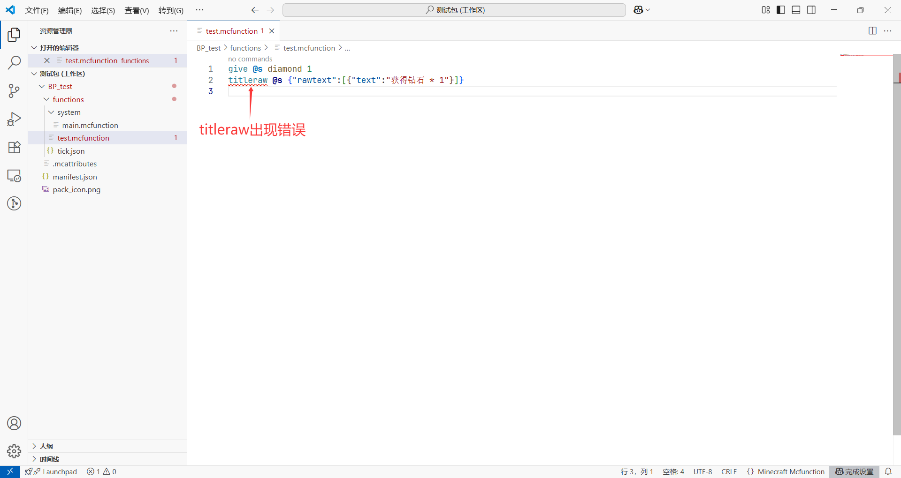
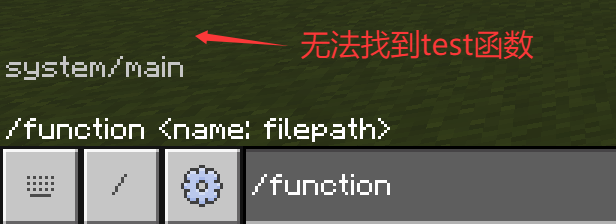
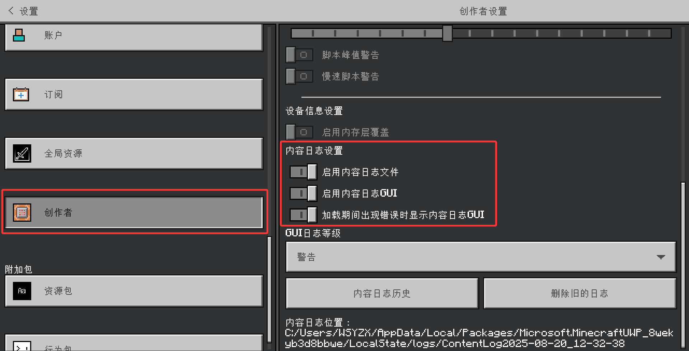
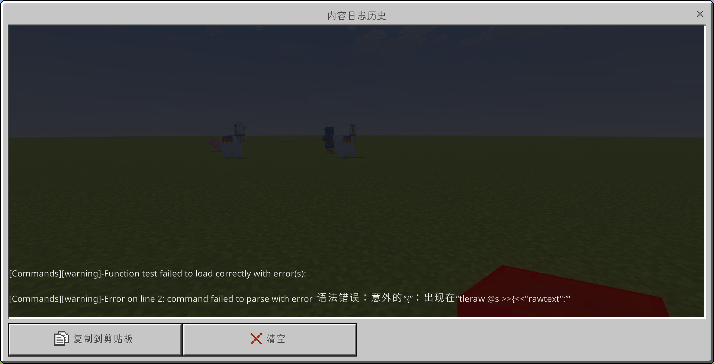

# 2.2 基于函数的命令系统

import '/src/css/treeview.css';
import DataType from "/src/components/type/data"
import FileType from "/src/components/type/file"

在上一节中，我们已经讲解了函数的基本原理和使用方法。但是，使用函数编程的思路，和使用命令方块编程的思路却多少有些不同。

- 首先，如果要将地图**全函数化**，以前可能按一个按钮就能实现的功能，现在却要**不断循环检测**，大费周章地检查按钮是否按下，并且很可能本来应该单次执行的命令却变成了循环执行。
- 相比于条件制约型命令方块，函数则必须使用`execute if|unless`来**指定条件**，使用记分板来**指定延迟时间**。
- 以及，无论使用什么编程思路，在设计关卡的时候总会见到大量重复的功能和命令。

所以，为了充分发挥函数式编程的优势，我们在下面提出几个经过长时间编程总结的经验思路，希望对你的开发有帮助。

## “事件”式思路 —— 在循环执行的函数里实现单次执行的思路

为了使函数自动执行，我们有几种思路：**利用命令方块、利用<FileType type="file" name="tick.json" />**、利用数驱物品方块实体执行命令的功能（当然这是后话了）、利用脚本（这也是后话了）。如果我们不希望使用命令方块的话，而函数系统整体来说又是循环执行的，这样一些本应该单次执行的函数就要被其他循环执行的函数执行，这就遇到了一个**单次执行和循环执行之间的矛盾**。

在模块 1 的第 3 章，我们曾引入了[**检测 - 循环链**](/docs/tutorials/a1_commands/b3_command_systems/c5_system_on_cb#循环链)和[**检测 - 脉冲链**](/docs/tutorials/a1_commands/b3_command_systems/c5_system_on_cb#检测---脉冲链)的概念，知道了为单次执行一串命令，只需要指定检测条件即可，**检测是循环的，而后面要执行的命令是单次的**。

对于函数系统，这自然也是同理的，由于检测条件达成时，我们可以认为这是一个“节点性”的事件，比如“玩家踩中了红色混凝土”、“玩家获得了钻石”、“僵尸杀死了村民”、“位于（0, 0, 0）的按钮被按下”等，所以后面执行的那一串命令，我们就可以定义其为一种**事件型函数**。换言之，**当前面的条件（也就是事件）达成时，单次执行一次事件型函数，这就是“事件”式思路**。

例如，在一个关卡中，如果玩家按下了位于（0, 0, 0）的朝向为 0 的按钮，就给予玩家一个金锭，我们可以在这个关卡内部这么写：

<treeview>

- <FileType type="folder" name="level_x" />：一个关卡所涉及的函数
  - <FileType type="folder" name="events" />：本关所涉及的事件
    - <FileType type="file" name="button_push.mcfunction" />：当按钮被按下时执行的命令
  - <FileType type="file" name="timeline.mcfunction" />：在本关范围内循环执行的函数

</treeview>

然后，我们这么设定命令内容：

```mcfunction title="level_x/timeline"
# 当玩家按下按钮后，触发按下按钮的事件
execute if block 0 0 0 stone_button ["facing_direction"=0,"button_pressed_bit"=true] run function level_x/events/button_push
```

```mcfunction title="level_x/events/button_push"
# 给予玩家金锭
give @p gold_ingot
# 将按钮复原，防止重复执行
setblock 0 0 0 stone_button ["facing_direction"=0,"button_pressed_bit"=false]
```

看，这就是“事件”式思路编程法！我们在后续学习脚本的时候，还要接触到大量由 Mojang 和网易提供给我们的事件，本质上也是“事件”式思路。

此外，如果事件在足够简单的情况下，我们其实无需单开一个事件函数，只需要写为一条命令就好了：

```mcfunction title="level_x/timeline"
# 当实体踩中红色混凝土则立刻杀死
execute as @e at @s if block ~~-1~ red_concrete run kill @s
```

但是，如果这么编写，确保其条件也会在这个过程中被更改，否则将无法实现单次执行。

## “时间线”式思路 —— 在无条件的瞬时函数里实现条件延迟执行的思路

相信你的地图不会只有一个关卡吧。这样的话，如果好几个关卡同时执行其对应的内容，就会造成大量的性能浪费。例如，如果你的地图有两个关卡，假设你的关卡架构为：

<treeview>

- <FileType type="folder" name="functions" />
  - <FileType type="folder" name="level_1" />：第 1 关
    - <FileType type="file" name="timeline.mcfunction" />：第 1 关循环执行的函数
    - ……
  - <FileType type="folder" name="level_2" />：第 2 关
    - <FileType type="file" name="timeline.mcfunction" />：第 2 关循环执行的函数
    - ……
  - <FileType type="folder" name="system" />：系统
    - <FileType type="file" name="main.mcfunction" />：主文件

</treeview>

那么，直接在主函数里这样指定，就会大量地浪费性能——因为如果玩家在玩第 1 关的时候，执行第 2 关的命令就是毫无必要的：

```mcfunction title="system/main"
function level_1/timeline
function level_2/timeline
```

那么，有什么思路可以降低性能消耗呢？道理很简单，我们只需要在玩家处于第 1 关的时候就只执行第 1 关的命令，在玩家处于第 2 关的时候就只执行第 2 关的命令，以此类推，并用`data.level`标记玩家处在第几关，当玩家进入关卡时更改这个值即可：

```mcfunction title="system/main"
execute if score level data matches 1 run function level_1/timeline
execute if score level data matches 2 run function level_2/timeline
```

事实上，这里已经是“时间线”思路的雏形了——我们把两条本来是无条件的命令改成了有条件的。就是这么简单。和事件的不同点在于，后面的函数都是**循环执行**的，所以至少在本教程，我们不说后面的函数是一种事件型函数，而是一种**时间线型函数**，它是带有条件地循环执行的。

但是，这还不够。我们在循环函数里还需要延迟执行的话，该怎么办？比如在关卡开始 30 秒后执行关卡内置的失败函数，但现在所有函数都是立刻执行的。这就要求我们引入一个计时系统，也就是**时间线（Timeline）**，这也是上面如此命名的缘由。我们希望，时间线不是时时刻刻都要加时间，要根据实际需求进行时间流逝，否则在某些情况下会很麻烦。这样，这个系统不仅**要确定计时的时间**，还要确定**它启用的状态**。

为完成这两个任务，我们需要引入两个变量：`time.timeline`（用于记录时间值）、`active.timeline`（用于记录时间线启用的状态）。然后规定：只有`active.timeline >= 1`的时候，时间线才能流逝，否则时间线便不工作。这样，我们可以定义主文件为

```mcfunction title="system/main" {3-4}
# 主文件

## 时间线
execute if score timeline active matches 1.. run scoreboard players add timeline time 1

## 关卡函数
execute if score level data matches 1 run function level_1/timeline
execute if score level data matches 2 run function level_2/timeline
```

这样，当我们在某些条件触发（也就是触发事件）启用了时间线后，就可以开始计时。比如在开始函数里规定`scoreboard players set timeline active 1`，然后系统便开始计时。然后，在循环执行的文件里规定`execute if score timeline time matches 600 run function .../fail`就可以达成我们的目标了。

这样定义，虽然基本解决了我们的问题，**也就是利用时间线这样的条件性计时系统满足我们的条件延迟执行的需求**，但是仍然有很多改进点。这些问题就留到我们的练习题里，来引起读者的思考。

## “库函数”式思路 —— 在大量的重复里提取出共同点的思路

通常，你会发现你的函数系统在编写的过程中需要大量地调用同一个逻辑。例如，对于分关卡式的地图来说，不同关卡之间具有高度的相似性，代码也长得十分类似。这样，你就可以把这种**高度重复且大量运用的代码提取出来**，专门归类整理到一处。编程领域，常常喜欢把这样的代码放到`lib`文件或文件夹里，意为 Library（库），所以我们这里起个名字叫**库函数**。

为什么只有高度重复且大量运用的代码适合提取出来？

- 如果不是高度重复的，就代表这些代码是偏向于“个性”而非“共性”的，它们只能胜任一小部分区域的任务，却不能胜任更通用情况下的任务。
- 如果不是大量运用的，比如只在两三处内存在重复，单独提取出这些代码会不太容易整理。

那么，把它们提取出来有什么优势？

1. 快捷。例如每一关都要设置重生点、播放标题、给予相同物品等等的话，就完全可以把这些带有共同点性质的东西提取出来，这样每次调用时就只需要少量地更改关卡独有的内容，十分地高效快捷。
2. 通用。如果所有关卡都要应用同一种更改，比如都要再加上一个传送到某处，那么对库函数的更改就可以应用到全局，而无需再对每个关卡进行更改。

例如，假设重生玩家时，每次的重生都需要把待重生玩家传送到重生点，然后更改玩家的游戏模式并将玩家回满血，则库函数可以写为

```mcfunction showLineNumbers title="lib/events/respawn_player"
# ===== 事件：玩家复活 =====
# 当玩家复活时执行的命令
# 调用此方法时：需修饰执行者为旁观玩家，执行位置为该关卡的重生点位置（execute as @s[tag=spectator] positioned (本关重生点)）。

# 传送玩家
tp @s ~~~
# 复活已死亡玩家
gamemode adventure @s
tag @s remove spectator
# 将玩家回满血
effect @s clear
effect @s instant_health 1 20 true

```

这是一个**完整地声明了其用途、调用前提和代码逻辑的函数**。这也是我们推荐读者写好注释的理由——因为库函数是重复度高的函数，且经常被调用，所以其调用条件最好写在文件内，以备不时之需。

这样，我们每次要复活玩家时，便不用重复地写 5 条命令，而只是调用该函数即可。是不是很方便？

## 给你的函数系统“找找茬” —— 如何规范化你的函数系统

> 以下内容也可以在[Bedrock Wiki 的函数教程](https://wiki.bedrock.dev/commands/mcfunctions)中找到。

每个人写函数的风格是不同的，这当然是可以理解的。但是，为了符合社区通用的规范，让我们的代码更加的简洁、优雅、健壮，可以考虑以下几个小建议来规范化你的函数系统。

1. **声明命名空间**。这在上一节中已经强调过，这是为了防止和其他人的包冲突。例如：
    - ✔️ BP/functions/**wiki**/random_number.mcfunction
    - ❌ BP/functions/random_number.mcfunction
2. **采用下划线命名法**。不要使用大写字符，毕竟命令中大小写没什么差别。例如：
    - ✔️ BP/functions/wiki/scoreboard/objectives/**add_all**.mcfunction
    - ❌ BP/functions/wiki/scoreboard/objectives/Add-All.mcfunction
3. **合理嵌套函数**。例如：
    - ✔️ BP/functions/wiki/**teleport/zone/hell**
    - ❌ BP/functions/wiki/teleport_hellzone
4. **动词在前，名词在后**。把你的函数写成它会做什么。例如：
    - ✔️ **shuffle_position**
    - ❌ position_shuffle
5. **单复数统一**。同一级内，要么全是单数，要么全是复数。例如：
    - ✔️ 下面的同级目录中，`ability`和`event`全是单数，而`players`和`worlds`则全是复数，命名统一。

      ```text
      BP/functions/wiki/ability/ice_blast.mcfunction
      BP/functions/wiki/ability/fire_trail.mcfunction
      BP/functions/wiki/event/players/on_death.mcfunction
      BP/functions/wiki/event/worlds/on_initialise.mcfunction
      ```

    - ❌ 下面的同级目录中，`abilities`和`event`、`players`和`world`单复数不统一，命名混乱。

      ```text
      BP/functions/wiki/abilities/ice_blast.mcfunction
      BP/functions/wiki/abilities/fire_trail.mcfunction
      BP/functions/wiki/event/players/on_death.mcfunction
      BP/functions/wiki/event/world/on_initialise.mcfunction
      ```

6. **理清层级关系**。在函数内如果有不同层级的功能，应该使用`#`表示一级逻辑，`##`表示二级逻辑，`###`表示三级逻辑，以此类推。这和 Markdown 很像。
    - ✔️ 下面的库函数中，一级、二级逻辑是分明的。

      ```mcfunction {11,13}
      # ===== 玩家数目检测器 =====
      # 返回总玩家数目（data.playerAmount）和存活的玩家数目（data.alivePlayerAmount）。
      # 调用此方法时：无需修饰。

      # 返回玩家总人数
      scoreboard players set playerAmount data 0
      execute as @a run scoreboard players add playerAmount data 1

      # 返回存活的玩家总人数
      scoreboard players set alivePlayerAmount data 0
      ## 如果在游戏中，返回非旁观者的玩家人数
      execute if score levelCompleted data matches 0 as @a[tag=!spectator] run scoreboard players add alivePlayerAmount data 1
      ## 如果不在游戏中，返回所有玩家人数
      execute unless score levelCompleted data matches 0 run scoreboard players operation alivePlayerAmount data = playerAmount data
      ```

    - ❌ 下面库函数中，难以看出`如果在游戏中，返回非旁观者的玩家人数`部分是在`返回存活的玩家总人数`。

      ```mcfunction {11,13}
      # ===== 玩家数目检测器 =====
      # 返回总玩家数目（data.playerAmount）和存活的玩家数目（data.alivePlayerAmount）。
      # 调用此方法时：无需修饰。

      # 返回玩家总人数
      scoreboard players set playerAmount data 0
      execute as @a run scoreboard players add playerAmount data 1

      # 返回存活的玩家总人数
      scoreboard players set alivePlayerAmount data 0
      # 如果在游戏中，返回非旁观者的玩家人数
      execute if score levelCompleted data matches 0 as @a[tag=!spectator] run scoreboard players add alivePlayerAmount data 1
      # 如果不在游戏中，返回所有玩家人数
      execute unless score levelCompleted data matches 0 run scoreboard players operation alivePlayerAmount data = playerAmount data
      ```

## 常见错误的排查方法

在[模块 1 的基于命令方块的命令系统](/docs/tutorials/a1_commands/b3_command_systems/c5_system_on_cb#常见错误的排查方法)中，我们讲到了几个排查方法：语法错误排查；在聊天栏运行成功，而在命令方块运行失败的排查法；逻辑性的错误排查法。对于函数来说，我们同样要来谈谈这几个排查方法，读者会发现这些排查法有很多的共同点，但也的确有一点点不同的地方。

### 利用内容日志进行语法错误排查

对于函数来说，**出现语法错误是非常致命的**，因为函数内**一旦出现一个语法错误，整个函数都无法执行**。例如我们定义一个函数<FileType type="file" name="test.mcfunction" />为：

```mcfunction
give @s diamond 1
titleraw @s {"rawtext":[{"text":"获得钻石 * 1"}]}
```



我们可以看到，在该函数中，第 2 条命令存在语法错误（缺少`title|subtitle|actionbar`），因此这整个函数都不会被 Minecraft 认为是一个有效函数，你甚至无法在自动补全中看到这个函数！



**当你无法在自动补全中找到应当看到的函数时，就应该开始怀疑语法是否出现了问题**。好在，出现了语法问题时，Minecraft 会试图告诉你问题出现在哪儿，这就是**内容日志**（**Content Log**）的作用。

但是，内容日志默认是不开启的。我们需要在设置 - 创作者 - 内容日志设置中启用内容日志，如下图所示。



小退重进后，我们会看到游戏开始在上方蹦出报错。这个报错也可以在设置的内容日志历史中找到：



我们看到这串内容日志详细地告诉我们错误位置和原因：

- 第一行 “\[Commands\]\[warning\]-Function **test** failed to load correctly with error(s):” 告诉我们，问题出在函数`test`中；
- 第二行 “\[Commands\]\[warning\]-Error on **line 2**: command failed to parse with error '**语法错误：意外的“\{”：出现在“tleraw @s >>\{\<\<"rawtext":”'**” 告诉我们，在第 2 行出现了一个语法错误，并且错误指向`{`。

相信在系统学习过模块 1 之后的读者应该能够很轻松地看懂这串报错的意义，灵活运用内容日志可以帮助我们避免这些低级错误。

此外，完全空白的函数文件也会报错，但是这问题就显得没那么严重了。

```mcfunction title="空白的test函数的内容日志报错"
[Commands][warning]-Couldn't load file functions/test.mcfunction in functions directory.
```

**在后面的附加包编程中，我们将无数次地和内容日志打交道**。

### 在聊天栏或命令方块运行成功，而在函数运行失败

在当时讲命令方块的时候，我们说过这是命令上下文不一致而引起的，所以遇到这种问题首先需要排查命令上下文的问题，对于不合适的命令上下文要使用`/execute`更改命令上下文。

这里引用上一节的总结内容：

> - 函数内命令上下文，取决于是谁调用了这个函数
>   - 如果是玩家调用的，则命令上下文为玩家的命令上下文
>   - 如果是服务器调用的（例如<FileType type="file" name="tick.json" />），则命令上下文为：执行者为空、执行位置为（0, 0, 0），执行朝向为（0, 0），执行维度为主世界
>   - **如果在测试时，玩家调用函数的效果和服务器调用函数的效果不一致，则可以排查命令上下文相关的问题**

例如，对于下面的函数

```mcfunction
give @s apple
```

如果是玩家执行是成功的，而其他执行者（包括服务器、命令方块或其他实体）执行就将是失败的。

### 逻辑性的错误

函数中，要格外关注逻辑性的错误。因为函数的执行方式和命令方块有一些不同（尤其是深度优先原则这一方面），使得函数先后执行顺序在某些方面变得格外重要。同样，在遇到类似的问题时，**先明确问题的表现形式，再想办法排查原因，可以逐行读代码查清原因（使用函数后，逐行读代码会变得快许多），最后视问题的解决难易和重要性予以解决**。

---

## 总结

本节，我们学习了在函数中编程所使用的一些基本思路，以及相关的错误排查法。让我们来回顾一下吧。

- 为了在循环执行的函数中实现单次执行，我们引入了“事件”这个概念。通过循环检测，触发事件型函数，并回调检测条件，就可以做到函数的单次执行。通常，事件型函数是单独列出的，并在习惯上可以放在<FileType type="folder" name="events" />里表示一个事件，例如<FileType type="file" name="player_join.mcfunction" />可以代表玩家重进游戏，在玩家进入游戏时执行；<FileType type="file" name="player_die.mcfunction" />可以代表玩家死亡，在玩家死亡时执行等等。
- 为了在无条件瞬时执行的函数中实现有条件延时执行，我们引入了“时间线”这个概念。通过引入这样一个延时执行的计时系统，我们可以规定什么时候执行什么命令。通常，要执行这些时间线对应的函数也是带有条件的，所以这种逻辑很适合特定关卡的循环逻辑。
- 为了快捷高效地执行大量重复应用的代码，我们引入了“库函数”这个概念。通过引入这样一类函数，我们可以快捷地调用一个函数来执行一长串逻辑，而且更改这个逻辑可以方便地使全局生效。
- 内容日志：排查附加包问题的一种基本手段。可以用于排查命令语法错误等，需要在设置中启用。

## 练习

:::info[练习 2.2]

现在我们给定一个基础的函数架构如下：

<treeview>

- <FileType type="folder" name="functions" />：
  - <FileType type="folder" name="levels" />：全部关卡
    - <FileType type="folder" name="level_1" />：第 1 关
      - <FileType type="folder" name="events" />：关卡事件
      - <FileType type="file" name="timeline.mcfunction" />：第 1 关循环执行的函数
      - <FileType type="file" name="start.mcfunction" />：开始第 1 关
      - <FileType type="file" name="complete.mcfunction" />：完成第 1 关
      - <FileType type="file" name="fail.mcfunction" />：未完成第 1 关
    - <FileType type="folder" name="level_2" />：第 2 关
      - ……（关卡架构和第 1 关类似）
    - <FileType type="folder" name="level_n" />：第 n 关
      - ……（关卡架构和第 1 关类似）
  - <FileType type="folder" name="lib" />：库函数
    - <FileType type="folder" name="get_data" />：获取数据
    - <FileType type="folder" name="modify_data" />：修改数据
    - <FileType type="folder" name="events" />：事件
      - <FileType type="file" name="player_die.mcfunction" />：玩家死亡时执行的命令
- <FileType type="folder" name="system" />：系统
  - <FileType type="file" name="main.mcfunction" />：主文件

</treeview>

并且假设主文件会在`data.level == n`的时候循环执行`levels/level_n/timeline`函数，在玩家死亡瞬间会执行`lib/events/player_die`函数（详情见练习 2.1 的第 2\~3 题）。

现在让我们尝试编写一个关卡的逻辑。假设第 5 关是一个随机位置生成随机怪物的关卡，玩家需要坚持 3 分钟后才能成功通过关卡。

1. 请选择合适的文件并实现：当`time.nextMonster == 0`时，触发一个生成怪物的事件，可以在（-122, -31, 6）、（-130, -31, -2）、（-130, -31, 14）、（-130, -31, 6）、（-138, -31, 6） 5 个坐标中的其中 1 个随机生成苦力怕、溺尸、僵尸、骷髅 4 种怪物中的 1 种，并在生成完毕后重新指定`time.nextMonster`为`3`到`10`中的任意一个值。允许自定义变量，允许创建新函数，允许使用盔甲架作为辅助实体，试实现之。
2. 每一秒都为`time.nextMonster`的值减 1 分，试实现之。假设`time.tick`是一个从`0`-`19`变化的，且每游戏刻加 1 分的变量。
3. 在`time.timeline == 3600`时触发完成函数，试选择合适的文件并实现之。
4. 在关卡开始时启用时间线并重置时间线的时间值。显然，该逻辑可能在多个关卡都适用，试选择合适的文件位置并编写库函数，然后回答在什么文件调用这个库函数。**在这个问题中，你会发现时间线系统需要一些库函数来更方便地控制其运行状态**。
5. 当玩家全部死亡后游戏失败，试选择合适的文件并实现之。可以选定文件并规定玩家死亡后获得`spectator`标签。
6. 当玩家在（-95, -30, -6）附近 2 格时，执行第 6 关的开始函数，试选择合适的文件并实现之。

基本上，完成上面 6 道练习题，你便发现你写出的关卡逻辑已经开始变得复杂了。同时，相信这个小练习也会为你理解本节内容提供一些帮助。

:::

<details>

<summary>练习题答案</summary>

注意：以下答案仅供参考，答案不唯一。

1. <FileType type="folder" name="levels" /> - <FileType type="folder" name="level_5" /> - <FileType type="file" name="timeline.mcfunction" />：

    ```mcfunction showLineNumbers
    # 第 5 关时间线

    ## 当倒计时为 0 时生成怪物
    execute if score nextMonster time matches ..0 run function levels/level_5/events/spawn_monster
    ```

    <FileType type="folder" name="levels" /> - <FileType type="folder" name="level_5" /> - <FileType type="folder" name="events" /> - <FileType type="file" name="spawn_monster.mcfunction" />：

    ```mcfunction showLineNumbers
    # 生成怪物

    ## 指定生成位置和生成种类
    scoreboard players random temp.monsterPos data 1 5
    scoreboard players random temp.monsterType data 1 4

    ## 生成辅助实体指定位置
    execute if score temp.monsterPos data matches 1 run summon armor_stand spawner -122 -31 6
    execute if score temp.monsterPos data matches 2 run summon armor_stand spawner -130 -31 -2
    execute if score temp.monsterPos data matches 3 run summon armor_stand spawner -130 -31 14
    execute if score temp.monsterPos data matches 4 run summon armor_stand spawner -130 -31 6
    execute if score temp.monsterPos data matches 5 run summon armor_stand spawner -138 -31 6

    ## 在spawner上生成怪物
    execute if score temp.monsterType data matches 1 at @e[name=spawner] run summon zombie
    execute if score temp.monsterType data matches 2 at @e[name=spawner] run summon creeper
    execute if score temp.monsterType data matches 3 at @e[name=spawner] run summon drowned
    execute if score temp.monsterType data matches 4 at @e[name=spawner] run summon skeleton

    ## 移除spawner
    kill @e[name=spawner]

    ## 重置倒计时
    scoreboard players random nextMonster time 3 10
    ```

2. <FileType type="folder" name="levels" /> - <FileType type="folder" name="level_5" /> - <FileType type="file" name="timeline.mcfunction" />：

    ```mcfunction showLineNumbers {3-4}
    # 第 5 关时间线

    ## 进行倒计时
    execute if score tick time matches 0 run scoreboard players remove nextMonster time 1

    ## 当倒计时为 0 时生成怪物
    execute if score nextMonster time matches ..0 run function levels/level_5/events/spawn_monster
    ```

3. <FileType type="folder" name="levels" /> - <FileType type="folder" name="level_5" /> - <FileType type="file" name="timeline.mcfunction" />：

    ```mcfunction showLineNumbers {9-10}
    # 第 5 关时间线

    ## 进行倒计时
    execute if score tick time matches 0 run scoreboard players remove nextMonster time 1

    ## 当倒计时为 0 时生成怪物
    execute if score nextMonster time matches ..0 run function levels/level_5/events/spawn_monster

    ## 3 分钟后通关
    execute if score timeline time matches 3600.. run function levels/level_5/complete
    ```

4. 我们可以将这种函数认为是一种修改数据的库，所以放到<FileType type="folder" name="modify_data" />里。

    <FileType type="folder" name="lib" /> - <FileType type="folder" name="modify_data" /> - <FileType type="file" name="enable_timeline.mcfunction" />：

    ```mcfunction showLineNumbers
    # 启用时间线
    # 设置时间线的启用状态为 1，并重置时间值。
    # 调用此方法时：无需修饰。

    scoreboard players set timeline active 1
    scoreboard players set timeline time 0
    ```

    在<FileType type="folder" name="levels" /> - <FileType type="folder" name="level_5" /> - <FileType type="file" name="start.mcfunction" />中，应添加`function lib/modify_data/enable_timeline`一行。

5. 定义获取存活玩家的库函数<FileType type="folder" name="lib" /> - <FileType type="folder" name="get_data" /> - <FileType type="file" name="alive_player_amount.mcfunction" />（因为该函数可能被其他文件多次调用）：

    ```mcfunction showLineNumbers
    # 获取存活玩家数
    # 获取当前不含有 spectator 标签玩家的数量。
    # 调用此方法时：无需修饰。

    scoreboard players set alivePlayerAmount data 0
    execute as @a[tag=!spectator] run scoreboard players add alivePlayerAmount data 1
    ```

    然后，在时间线文件中调用该方法以获取存活玩家数。

    <FileType type="folder" name="levels" /> - <FileType type="folder" name="level_5" /> - <FileType type="file" name="timeline.mcfunction" />：

    ```mcfunction showLineNumbers {12-14}
    # 第 5 关时间线

    ## 进行倒计时
    execute if score tick time matches 0 run scoreboard players remove nextMonster time 1

    ## 当倒计时为 0 时生成怪物
    execute if score nextMonster time matches ..0 run function levels/level_5/events/spawn_monster

    ## 3 分钟后通关
    execute if score timeline time matches 3600.. run function levels/level_5/complete

    ## 当玩家全部淘汰后失败
    function lib/get_data/alive_player_amount
    execute if score alivePlayerAmount data matches 0 run function levels/level_5/fail
    ```

6. <FileType type="folder" name="levels" /> - <FileType type="folder" name="level_5" /> - <FileType type="file" name="timeline.mcfunction" />：

    ```mcfunction showLineNumbers {16-17}
    # 第 5 关时间线

    ## 进行倒计时
    execute if score tick time matches 0 run scoreboard players remove nextMonster time 1

    ## 当倒计时为 0 时生成怪物
    execute if score nextMonster time matches ..0 run function levels/level_5/events/spawn_monster

    ## 3 分钟后通关
    execute if score timeline time matches 3600.. run function levels/level_5/complete

    ## 当玩家全部淘汰后失败
    function lib/get_data/alive_player_amount
    execute if score alivePlayerAmount data matches 0 run function levels/level_5/fail

    ## 当玩家到达下一关时开始下一关
    execute if entity @a[x=-95,y=-30,z=-6,r=2] run function levels/level_6/start
    ```

---

事实上，本题改编自我们的地图《冒险小世界：剑之试炼》的关卡 4-4。虽然该关卡所采用的时间线远比本题复杂，但只要明确需求，你也可以写出同等复杂的函数！

（下列代码取自该地图的 Alpha 4.2_02 版本，为项目源代码）

```mcfunction showLineNumbers
# ===== 关卡游戏时时间线 =====
# 4-4

# --- 怪物生成 ---
## 令下一个怪物的剩余时间进行倒计时
execute if score tick time matches 0 run scoreboard players remove temp.nextMonster time 1
## 当倒计时为 0 后，尝试生成怪物并重置倒计时
execute if score temp.nextMonster time matches 0 run function aw/levels/chapter4/level4/events/spawn_monster

# --- 胜利条件 ---
## 令下一个怪物的剩余时间进行倒计时
execute if score tick time matches 1 run scoreboard players remove temp.remainingTime time 1
## 当关卡剩余时间为 0 时，结束关卡
execute if score temp.remainingTime time matches 0 run function aw/levels/chapter4/level4/complete

# --- 检查存活玩家数目 ---
# 如果存活玩家数目为 0，则触发关卡失败函数
execute if score alivePlayerAmount data matches 0 run function aw/levels/chapter4/level4/fail

# --- 阻止旁观模式的玩家出界 ---
# 不处理正处于死亡状态的玩家
# 在该关卡上方80格的位置存在与该房间同样大小的屏障外壳，只要眼部检查到上方80格为屏障就立刻判定为出界
execute as @a[tag=spectator,scores={deathState=0}] at @s anchored eyes if block ~~80~ barrier positioned -141 -30 6 run function aw/lib/events/player_out_of_border
execute as @a[tag=spectator,scores={deathState=0}] positioned -156 -11 14 if entity @s[r=2] run tp @s -141 -30 6

```

```mcfunction showLineNumbers
# ===== 生成怪物 =====
# 当怪物生成时间为 0 时尝试生成

# --- 随机指定刷新位置和怪物类型 ---

## 随机数值
    scoreboard players random temp.nextMonsterPos data 1 5
    scoreboard players random temp.nextMonsterType data 1 8

## 确定生成器位置
    execute if score temp.nextMonsterPos data matches 1 run summon aw:spawner -122 -31 6
    execute if score temp.nextMonsterPos data matches 2 run summon aw:spawner -130 -31 -2
    execute if score temp.nextMonsterPos data matches 3 run summon aw:spawner -130 -31 14
    execute if score temp.nextMonsterPos data matches 4 run summon aw:spawner -130 -31 6
    execute if score temp.nextMonsterPos data matches 5 run summon aw:spawner -138 -31 6

## 确定生成器类型
    execute if score temp.nextMonsterType data matches 1 run event entity @e[type=aw:spawner] aw:spawn_creeper_energy
    execute if score temp.nextMonsterType data matches 2 run event entity @e[type=aw:spawner] aw:spawn_creeper_speed
    execute if score temp.nextMonsterType data matches 3 run event entity @e[type=aw:spawner] aw:spawn_skeleton_3
    execute if score temp.nextMonsterType data matches 4 run event entity @e[type=aw:spawner] aw:spawn_stray_3
    execute if score temp.nextMonsterType data matches 5 run event entity @e[type=aw:spawner] aw:spawn_drowned_3
    execute if score temp.nextMonsterType data matches 6 run event entity @e[type=aw:spawner] aw:spawn_drowned_trident
    execute if score temp.nextMonsterType data matches 7 run event entity @e[type=aw:spawner] aw:spawn_zombie_3
    execute if score temp.nextMonsterType data matches 8 run event entity @e[type=aw:spawner] aw:spawn_zombie_baby_3

# --- 重置倒计时 ---
scoreboard players random temp.nextMonster time 3 10

```

</details>

import GiscusComment from "/src/components/comment/giscus.js"

<GiscusComment/>
