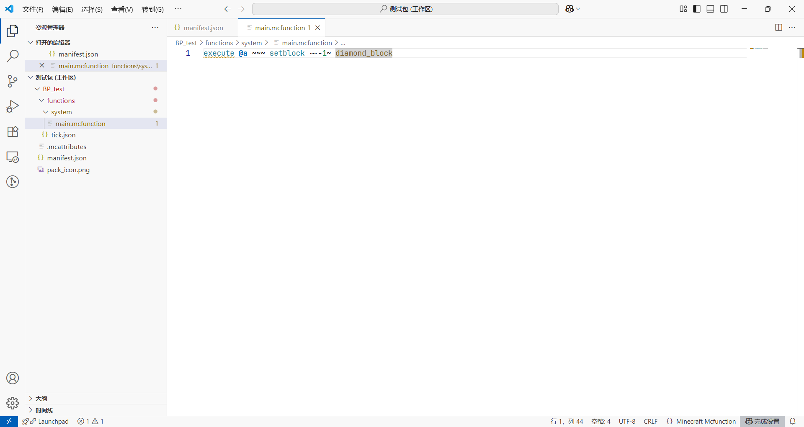
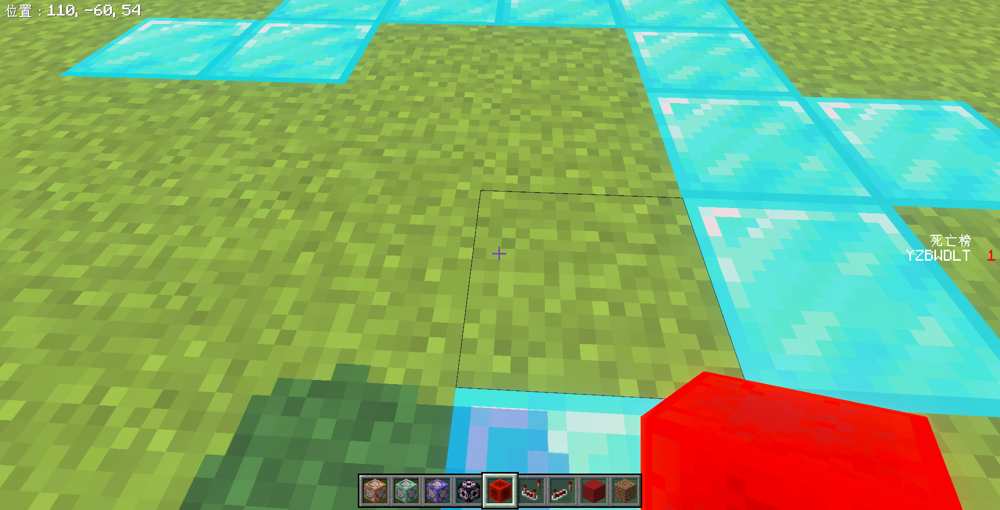

# 2.3 *旧版本函数

import '/src/css/treeview.css';
import DataType from "/src/components/type/data"
import FileType from "/src/components/type/file"

:::warning[温馨提醒]

**你可能已经见过这个警告框了，没错，我们在[模块 1 的 2.3.4 节](/docs/tutorials/a1_commands/b2_commands/c3_execute/d4_old_grammar)曾经做过这个警告。对于本节仍然同理。**

本条目内容只在以下情况下生效：

- 低于 1.19.50 的国际版版本
- 低于 3.0 的中国版版本
- 引擎版本为低于 1.19.50 的行为包（*← 本节符合此情形*）
- 格式版本为低于 1.19.50 的可执行命令的实体、动画控制器等文件

为以防万一（毕竟可能真的有极少数情况下，在现阶段还有开发者需要这些东西），所以我们还是简单提一下。然而，我们仍需再次强调：**这些内容已经过时，因此全篇内容都是扩展内容，仅作为简单了解**！如果你不愿意了解这些的话，跳过这一节也是没有问题的。

为使用旧版语法，读者必须对旧版语法有所了解，否则极易在这方面犯错。本教程系列给出`/execute`的旧语法介绍，但其他命令的旧语法恕不提供。

:::

本节我们来讨论一个过时内容。毕竟确实仍有极少数开发者目前仍然需要这些内容。我们来讨论如何在新版合法地使用旧版语法（主要以`/execute`为例介绍）。

还记得我们曾在讲清单文件<FileType type="file" name="manifest.json" />的时候，曾经说过的最小引擎版本吗？我们来回顾一下：

> - <DataType type="array" name="min_engine_version" isRequired/>：最小引擎版本。定义你的附加包至少需要什么游戏版本才能使用。
>
> 最小引擎版本是很重要的一个参数。在这里，读者先了解这个参数最核心的含义就行，**也就是只有高于此版本的 Minecraft 才能使用该附加包**。比如，如果要为了中国版玩家考虑的话，这个值不应该低于`[ 1, 21, 0 ]`，也就是当前的中国版版本。后面，我们会聊到这个版本还会影响什么内容的解析。
>
> 应该额外注意一点：**`format_version`会影响这个参数的解析，所以我们才要求读者不要更改格式版本，应设置为`2`**。

现在，**我们给出这个版本还会影响什么内容的解析——命令版本的解析**！是的，所有命令本身是有一个版本在严格对应的。在更改命令的时候，Mojang 会更新这个命令的版本，同时保留旧版本的解析方式，使得旧版的附加包不会随着新版本的更新而无效化。这也是当初 1.19.50 更新`/execute`的时候，旧版命令方块在不更改的情况下不会受到影响的理由。

关于命令版本，读者可以查阅 [Minecraft 基岩版开发 Wiki 的这篇文章](https://wiki.mcbe-dev.net/p/Manual:/execute)了解一点信息，当然如果你问我怎么看，我只能回答你我也不会，而且这也不是重点，我们只需要知道有这么一回事儿就好了。总之，后面的命令版本我们一概按照最小引擎版本处理。

Minecraft 的命令事实上很早就已经应用到类似的更改了，但最广为人知的一次是 1.19.50 的`/execute`新语法化，相信读者在模块 1 也清楚这个版本究竟发生过什么——这是一个划时代的版本！然而，我也见过许多的“顽固派”、“妥协派”，他们不喜欢新语法、不愿意学习新语法、有的开发者被迫无法使用新语法，甚至连声称“*新语法能做到的，旧语法都能做到*”这种荒谬言论的都有。虽然原因多种多样，但并不能否认的是：旧语法仍然残留有一小部分市场。**这种情况，我们普遍认为函数是更适合这类开发者的**。

通过前文的讲解，读者便知道，为使用旧版语法，**关键点其实在<FileType type="file" name="manifest.json" />的<DataType type="array" name="min_engine_version"/>上**。我们只需要把这个版本调的低一些即可，例如如果要使用旧版的`/execute`语法，我们可以把最小引擎版本改成`[ 1, 19, 40 ]`或者更低版本，比如网易之前长时间停留在 1.18 时期的时候，我们可以如此指定（*当然现在网易也早已更新，非必要情况下我们实在不推荐读者再使用旧语法！*）：

```json showLineNumbers title="manifest.json" {8}
{
    "format_version": 2,
    "header": {
        "name": "行为包",
        "description": "行为包",
        "uuid": "d5fe1d02-79f2-4da7-a641-432a1390f8a8",
        "version": [ 1, 3, 7 ],
        "min_engine_version": [ 1, 18, 0 ]
    },
    "modules": [
        {
            "type": "data",
            "uuid": "b14aaa05-e524-4e9b-be1b-c98a0a4d2103",
            "version": [ 1, 0, 0 ]
        }
    ]
}
```

在如此设定了之后，我们便可以在新版本使用旧语法了！读者可以尝试在主函数下使用下面的命令试试效果：

```mcfunction
execute @a ~~~ setblock ~~-1~ diamond_block
```



如果读者熟悉旧语法应该知道，这是往玩家脚下放钻石块的命令（*甚至我写这命令的时候已经很生疏了，不本能地写个`run`都算我在思考了orz*），进入游戏后效果应该如图所示：



读者可以看到图中的 Vibrant Visuals 的效果，证明确实是新版本，而我们成功在新版本运行了旧语法，证明这确实是可行的！

## 总结

本节所讲的东西很简单——通过更改<FileType type="file" name="manifest.json" />的<DataType type="array" name="min_engine_version"/>来使用旧语法。当然，**如果你在编写函数的过程中发现无法使用新语法，则为<DataType type="array" name="min_engine_version"/>调的过低的结果，建议至少也要调到网易当前所对应的版本**。
