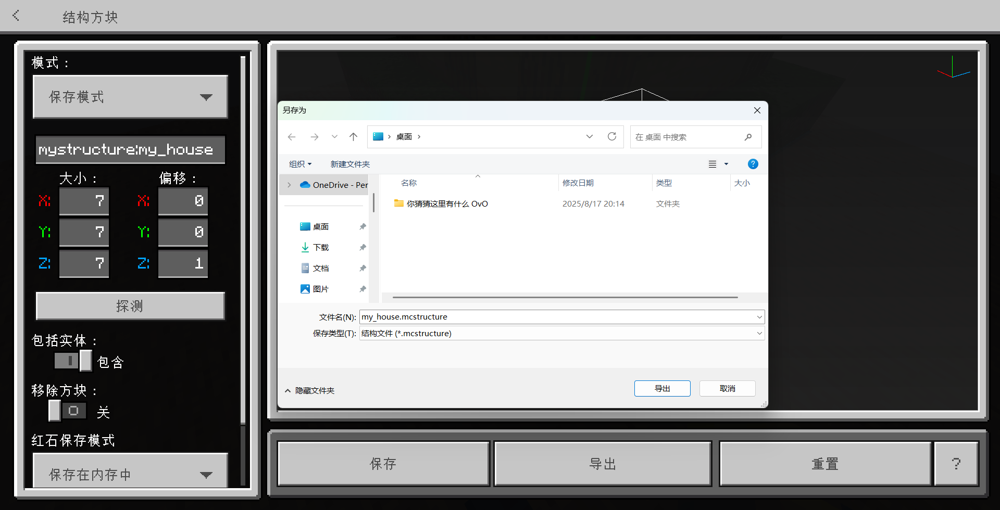
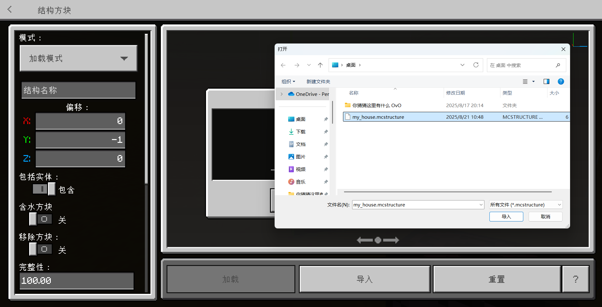
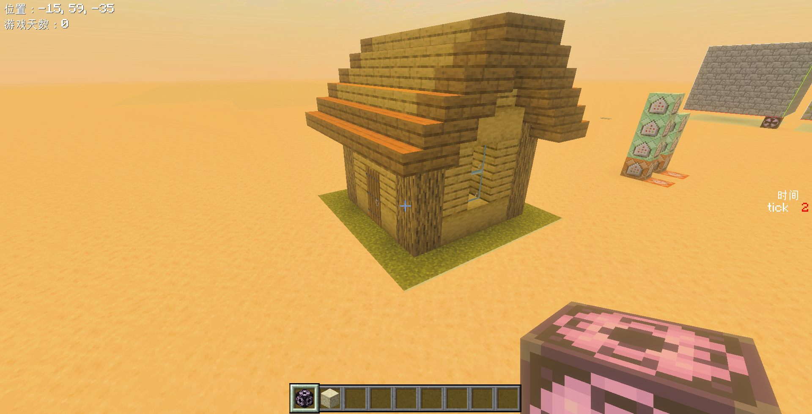
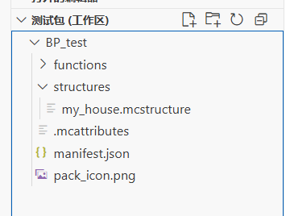
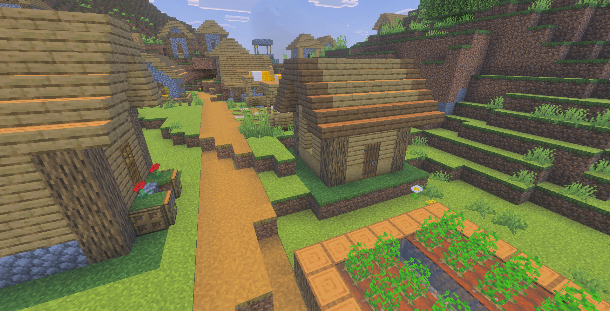
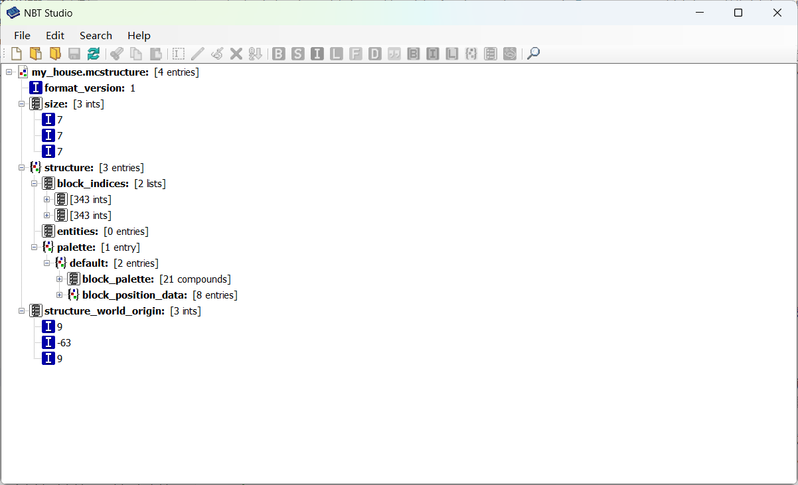
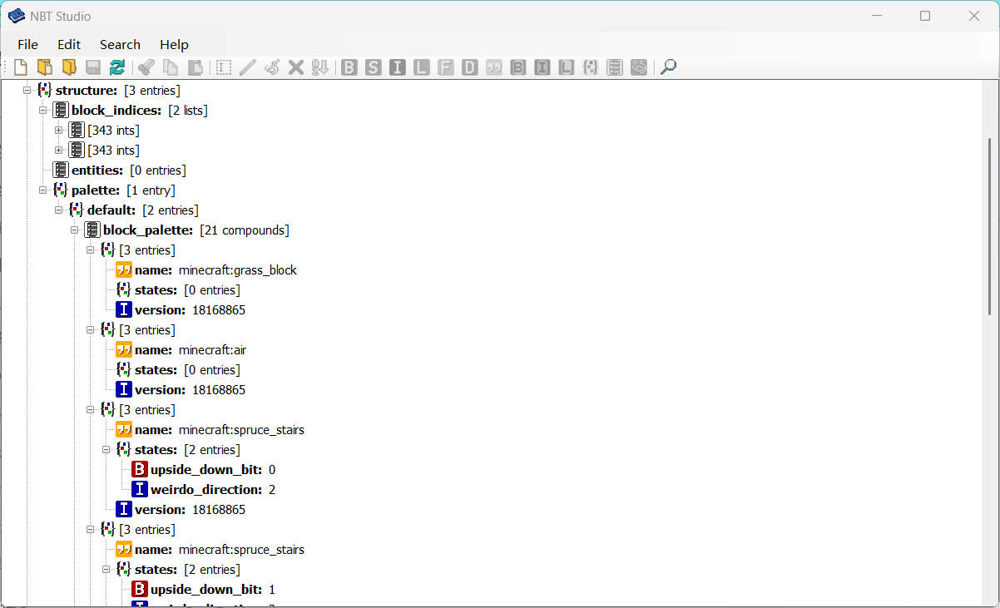

# 2.4 结构

import '/src/css/treeview.css';
import DataType from "/src/components/type/data"
import FileType from "/src/components/type/file"

:::warning[温馨提示]

本节内容仅适用于电脑端。除非读者能够在手机上通过安装特定资源包的方法导出`.mcstructure`文件。

:::

我们曾在[模块 1 的 3.3 节](/docs/tutorials/a1_commands/b3_command_systems/c3_structure_block)讲解过结构方块的用法，如今还要再和结构方块打交道。但这一节，我们主要从其导出的文件`xxx.mcstructure`入手。

## 跨存档导出导入结构

我们知道通过结构方块可以导出结构文件，下面我们以一个小房子为例，先导出它的结构文件：



我们知道，在 1.20.50 更新后，加载模式的结构方块可以直接导入一个结构，这极大地简化了跨存档导出导入结构的难度。例如，在另一张地图里通过这个方式可以直接导入结构：




但是，在玩法地图中我们却不能让玩家自行手动导入结构——因为大多数玩家都不会用结构方块。以前，我们是直接把结构保存到地图内部的，但是我们现在要讲一种新的手段，也就是利用附加包来保存结构文件。利用附加包保存结构文件有一个优点，**就是任选一张地图，只要安装了我们的包，就都可以使用**。

我们在**行为包**根部创建一个新的文件夹，叫<FileType type="folder" name="structures" />，然后把我们刚导出的结构文件放到该文件夹中。现在你的包应该长这样：

<treeview>

- <FileType type="folder" name="BP_test" />：行为包
  - <FileType type="folder" name="functions" />
    - ……
  - **<FileType type="folder" name="structures" />：结构**
    - **<FileType type="file" name="my_house.mcfunction" />：我们保存的结构文件**
  - <FileType type="file" name="manifest.json" />
  - <FileType type="image" name="pack_icon.png" />

</treeview>



在保存了这些之后，我们可以在其他地图试试效果。可以用`/structure`命令试试效果：

```mcfunction
/structure load my_house ~~~
```



看！效果还不错，可以以假乱真咯，嘿嘿。

## 为结构添加命名空间

结构是我们学到的附加包的第二个应用，它的应用范围也比函数要广泛一些。因为我们学习附加包，思路就不会仅仅局限于命令了，所以函数（命令）的用途在附加包中没有特别广泛；但是对于世界生成领域（我们会在第 10 章学习）来说，我们也同样需要结构，所以结构的应用面更广。这样，为了防止和别人的包冲突，**为结构添加一个命名空间就显得很有必要了**。不仅如此，我还用亲身经历尝试过，如果不为结构添加命名空间，那么**在上传到中国版的资源中心时，这些结构会被认为是无效结构，所以请务必添加一个命名空间**！

那如何添加一个命名空间呢？和函数类似，我们在前面套上一个文件夹即可：

<treeview>

- <FileType type="folder" name="BP_test" />：行为包
  - <FileType type="folder" name="functions" />
    - ……
  - <FileType type="folder" name="structures" />：结构
    - **<FileType type="folder" name="my_namespace" />：命名空间**
      - <FileType type="file" name="my_house.mcfunction" />：我们保存的结构文件
  - <FileType type="file" name="manifest.json" />
  - <FileType type="image" name="pack_icon.png" />

</treeview>

对应地，我们要把结构名由`my_house`改为`my_namespace:my_house`，也就是在前面添加命名空间，中间用`:`分隔。基本上所有命名空间和后面的 ID 都是用冒号分隔的。其实，细心的读者或许已经发现，我们每次用结构方块保存结构的时候，前面都会加上一段东西，也就是`mystructure:`，这就是默认的命名空间了。例如，刚刚我们写为

```mcfunction
/structure load my_house ~~~
```

那么现在，我们要改为：

```mcfunction
/structure load my_namespace:my_house ~~~
```

再次强调：**为结构添加命名空间不是建议，是必要的步骤！不这么做的话在中国版发布的资源就会出现问题！**

## *更改结构构造：NBT Studio

结构文件说到底也是一种文件，你有没有好奇过它究竟是如何储存数据的？然而，Mojang 并没有开放这种文件的读取权限，如果你使用 VSC 强行打开它的话，通常都是打不开的，而且擅自修改会导致结构文件遭到损坏。那我们怎么查看里面的内容呢？

好在，社区已经有很多大佬为此付出过努力，并且给出了能够成功打开这种文件的方法，也就是依托特定的软件——[NBT Studio](https://github.com/tryashtar/nbt-studio/releases)，读者可以在 GitHub 下载此软件。

下载好 NBT Studio 后，我们将导出的`.mcstructure`文件拖到软件里面，可以看到结构真正储存的数据：



关于 NBT 的语法结构，我们在此不过多涉及，感兴趣的读者可以在 Wiki 中查到。例如，我们可以看到结构中所有使用到的方块类型：



在极少数情况下，也可能会有直接通过此方式修改结构文件的需求。

---

## 总结

我们在本节着重从结构文件入手展开，介绍了如何通过结构方块直接跨存档导出导入结构，和利用附加包保存结构的方法。我们将结构文件放到行为包的<FileType type="folder" name="structures" /> - <FileType type="folder" name="（命名空间）" />的文件夹里，并使用`(命名空间):(结构名)`来调用这个结构。

## 练习

:::info[练习 2.3]

试保存几张不同颜色的床的结构，然后保存到附加包里。例如，橙床可以保存为`bed:orange`，这样我们便解决了无法通过纯命令放置不同颜色床的问题。

:::

import GiscusComment from "/src/components/comment/giscus.js"

<GiscusComment/>
