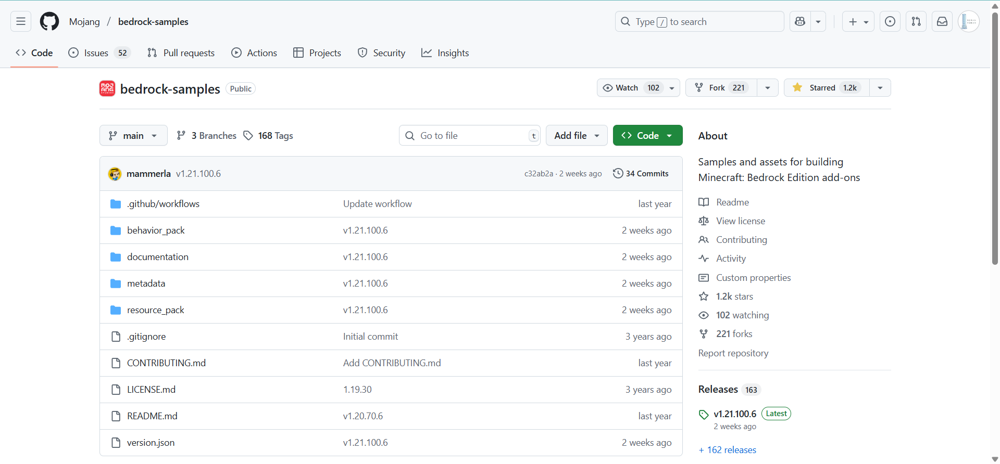
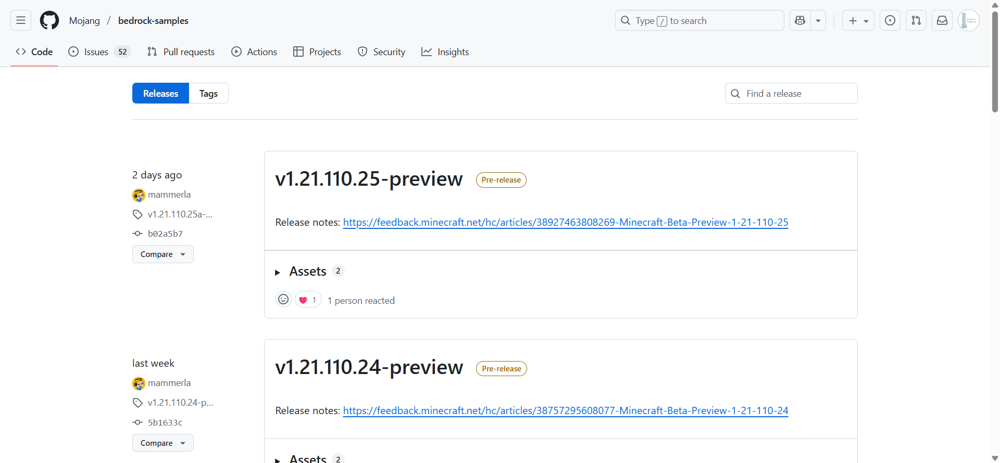
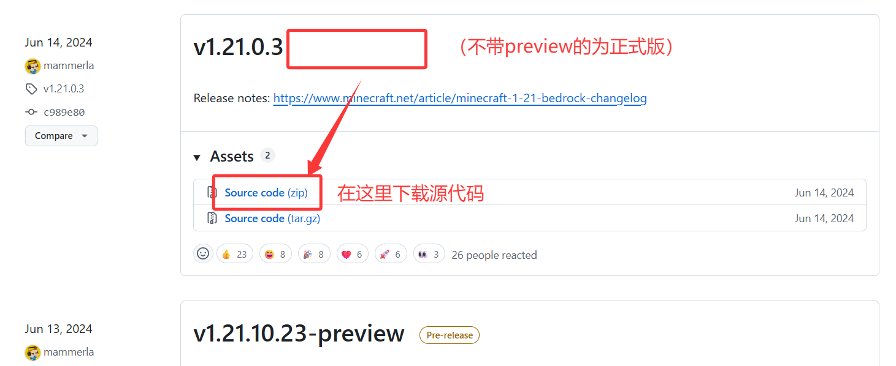
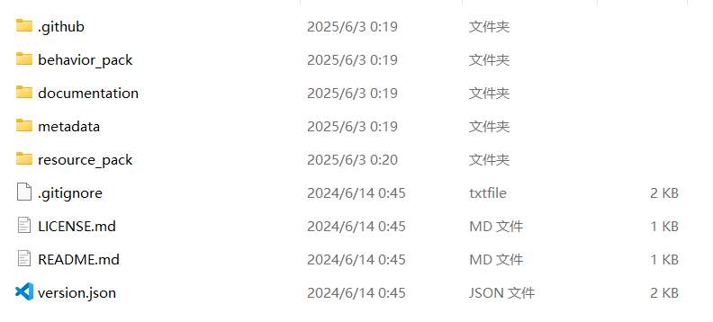
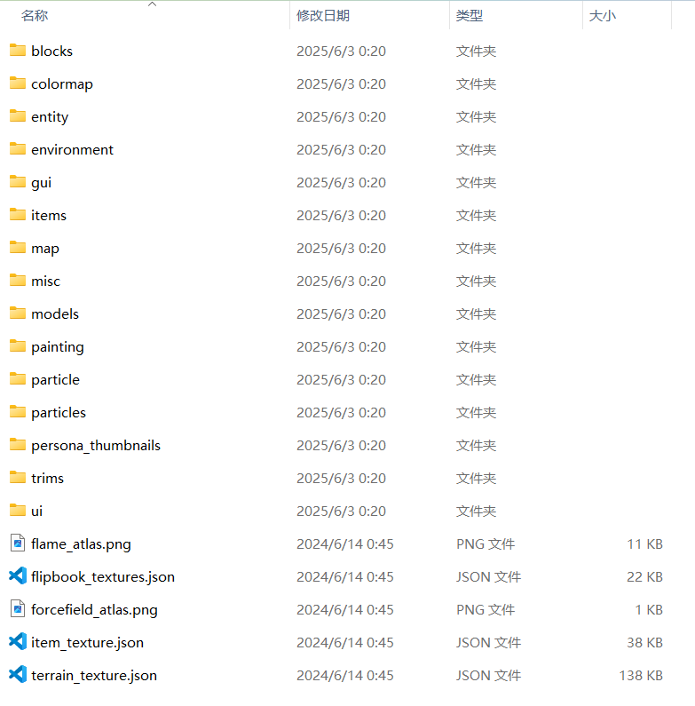
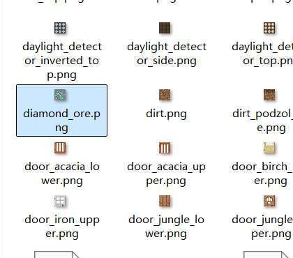
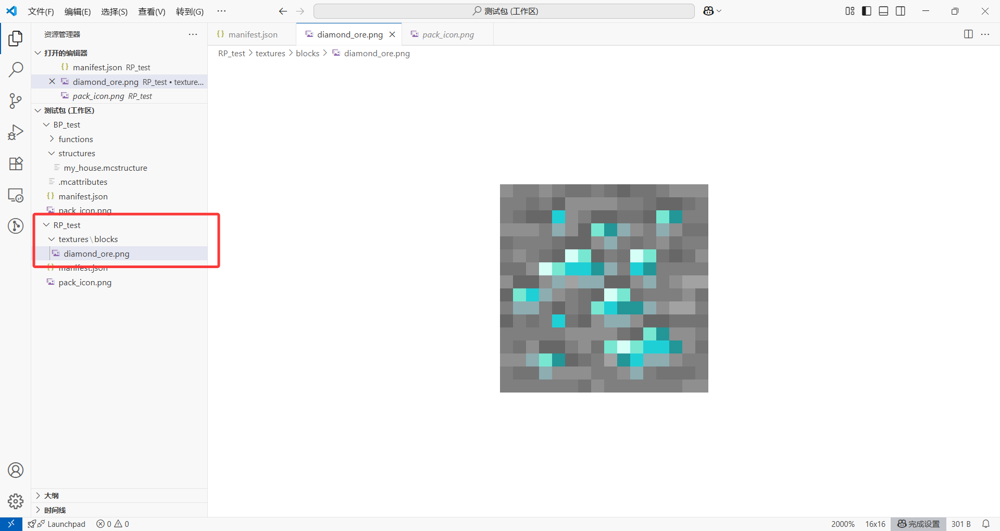
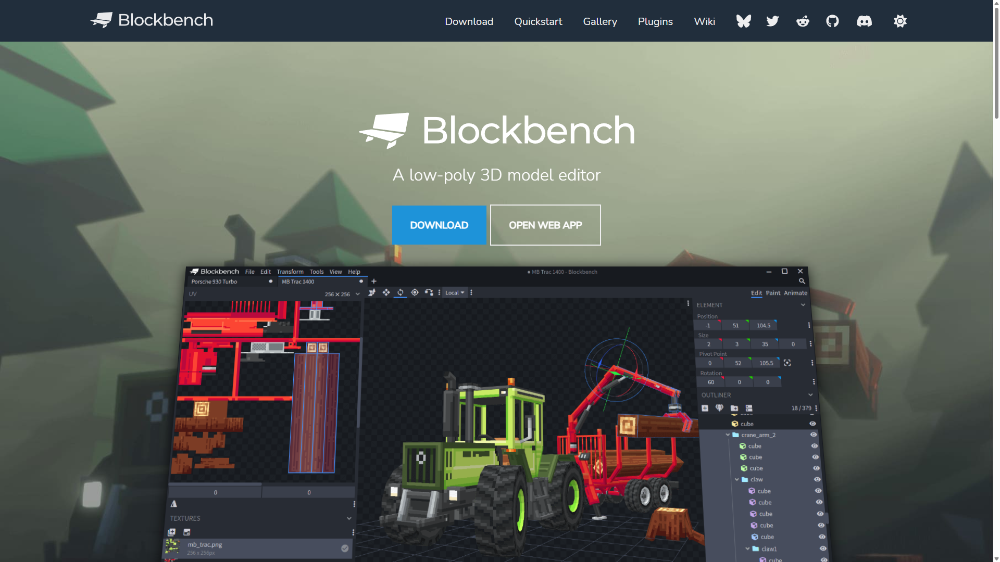
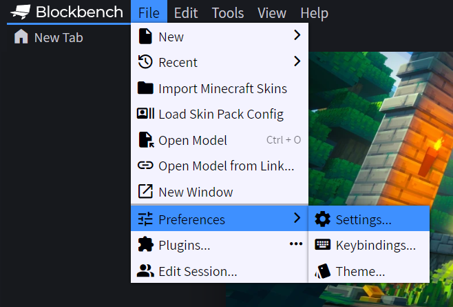
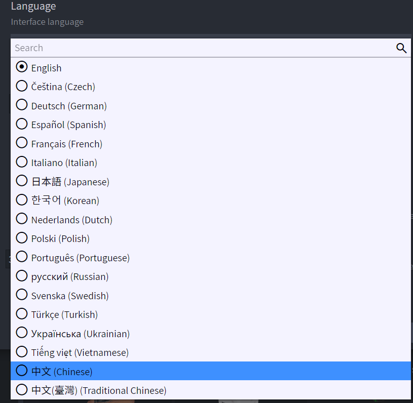

# 3.2 如何制作一个贴图包

import '/src/css/treeview.css';
import DataType from "/src/components/type/data"
import FileType from "/src/components/type/file"

## 贴图包的架构

既然贴图包是一种资源包，那么我们就要先创建一个资源包的框架：

<treeview>

- <FileType type="folder" name="RP_test" />：资源包
  - <FileType type="file" name="manifest.json" />：清单文件
  - <FileType type="image" name="pack_icon.png" />：包图标

</treeview>

然后，我们要在资源包根部创建一个新文件夹<FileType type="folder" name="textures" />，用来保存我们的贴图：

<treeview>

- <FileType type="folder" name="RP_test" />
  - **<FileType type="folder" name="textures" />：贴图**
  - <FileType type="file" name="manifest.json" />
  - <FileType type="image" name="pack_icon.png" />

</treeview>

:::warning[注意]

对于中国版来说，要上传一个资源包就必须带有<FileType type="folder" name="textures" />文件夹。虽然资源包分为很多种，并不需要一定带有这个文件夹，但是**中国版已经强制如此规定，如果不带有该文件夹会导致资源无法上传**。

:::

对于 Minecraft 来说，并不是一切贴图形式都是可以接受的，**只有`.png`文件和`.tga`文件是允许的**。例如：

- ✔️ <FileType type="image" name="apple.png" />
- ❌ <FileType type="image" name="apple.jpg" />

关于`.tga`文件，我们会在讲到实体的时候再简单介绍。

:::danger[警告]

**对于图片文件和音频文件，禁止直接把不符合要求的文件强制改后缀名使其“符合要求”**！例如不要把`apple.jpg`强制改为`apple.png`。因为不同文件类型代表其内部存储数据的方式并不一致，这样更改很容易使得文件解析错误，导致在游戏内不生效。即使生效，也完全无法保证其在未来仍然能够生效。

正确的做法是**运用专门的转换软件**（例如可以在网上搜索在线转换 png 的软件，或者使用更专业的软件，例如 ffmpeg，这个软件我们会在第 8 章讲解），**将不符合要求的文件转换为真正符合要求的文件，而不是草草改后缀名了事**。

再次强调，**这种行为是对自己作品极不负责的表现**！

:::

## 更改原版贴图 —— 以添加方块边框为例

一般来说，纯贴图包作者的工作通常都只有一个：**更改原版贴图**。

然而，对于原版的物品、方块、实体，以至于环境、粒子、UI 贴图，虽然都是存在<FileType type="folder" name="textures" />文件夹里的，却不是一股脑硬塞进去的，而是分门别类套在文件夹或者子文件夹中，这要求我们必须想办法知道原版是怎么分配的物品，并得到原版的贴图，然后才能着手更改。

好在，官方已经通过他们的方式为我们提供了获取这些原版内容的方法，也就是通过官方的 GitHub 获取模板。

### 官方模板

我们现在打开 Mojang 提供的官方模板的 [GitHub 仓库（Mojang/bedrock-samples）](https://github.com/Mojang/bedrock-samples)，在国内可能 GitHub 的访问速度比较缓慢，读者可以尝试使用 Steam++（现名 Watt Toolkit，微软商店上可下载）等软件加速。我们建议收藏该网址，**后面我们要无数次地用到官方模板**。

如果读者使用电脑，可以在右侧看到一栏 Release，这就是目前 Mojang 在 GitHub 上传的极大多数附加包模板的版本。如果是中国版或双版本开发者，我们可以选择中国版所对应的国际版版本；如果是国际版开发者，则通常选择最新的正式版。

例如，我们找到 1.21.0 的正式版本，也就是不带`-preview`的版本，点击 Assets，然后点击 Source code (zip) 即可开始下载。因为国内网络原因，下载需要一定的时间，需要耐心等待。

下载完成后，我们将包解压到某处，你可以看到官方提供的包还是比较齐备的，有很多内容可供我们学习。

针对于我们现在的任务，我们打开<FileType type="folder" name="resource_pack" /> - <FileType type="folder" name="textures" />文件夹，读者应该能看到很多内容：

这些就是原版用到的贴图了。**接下来我们只需要修改这些贴图，并按照*原路径*放到我们的包中，就可以应用我们的更改了**。

### Blockbench

现在我们要想办法修改官方给出的贴图，例如……为钻石矿添加一个闪亮的蓝色边框！我们首先找到钻石矿的文件位置，这应该是很好找的，就在<FileType type="folder" name="textures" /> - <FileType type="folder" name="blocks" /> - <FileType type="image" name="diamond_ore.png" />：

知道了原路径并找到贴图后，我们在我们的包中**创建一个相同的路径**，并把贴图**复制**到我们的包里：

之所以不剪切，是因为官方的模板包在其他地方还能派上很多用场，所以我们只需要复制原版的代码就行，尽量不要做出修改。这样，我们就能在我们自己的包里看到钻石矿的贴图了。

现在我们要修改这个贴图。修改贴图的软件有很多，毫无疑问 Photoshop 应该是最专业的（之一），但本教程的重点不打算放到 Photoshop 上。它虽然足够专业，但只能应付贴图工作。我们在这里推荐一款“更适合 MC 开发者宝宝体质”的软件——**Blockbench**（简称 **bb**）。

先来对这个软件做一点简单介绍，它是一款用于为 Minecraft 的方块和实体建模的软件。不要一听到建模二字就感觉可怕，这件事并没有你想象的那么复杂。而且，我们现在也并不打算用它的建模功能，你可以认为建模是它的主业，但它也可以从事一些“副业”，比如画贴图、制作实体动画等，它也很专业。

首先我们要先下载 Blockbench，我们打开 [Blockbench 的官网](https://www.blockbench.net/)，选择 DOWNLOAD 以开始下载。

然而，Blockbench 在国内的下载速度极其缓慢，请读者务必耐心等待。不要觉得 Blockbench 下载时间长就要放弃了哦，因为**我们后面做方块和实体的时候要多次地用到 Blockbench**。读者可以耐心等待，或者采用一些特殊手段来提速，或者[**下载我们事先准备好的这个安装包**](https://app.nekodrive.net/s/RZ2te)（`.exe`为 Windows 可用，`.dmg`为 MacOS 可用，其他平台恕不提供，下载日期 2025 年 8 月 22 日，能用就行了，需要更新可以评论回复哦）。如果实在没有条件下载的话，我们用网页 APP 也是可以的，也就是点击 OPEN WEB APP。当然，使用线上软件的体验就没有线下软件好了，因为要正常使用需要等待加载也是比较烦人的。

下文，我们假设读者已经正常下载完并安装软件（*毕竟有我们提供的安装包，理论上应该都能下载吧*）。打开软件，读者可以在 File - Preferences - Settings 中切换语言为简体中文，如下两图所示：

重启软件后，你的 Blockbench 就改为中文了。
