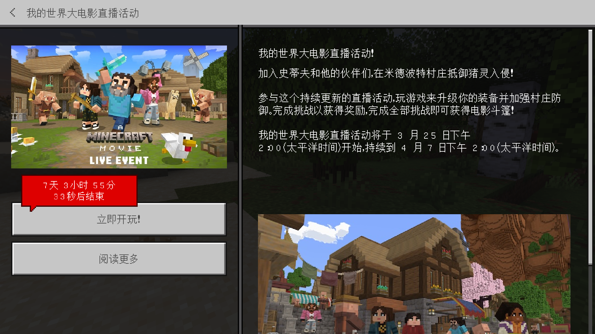

# 3.3 *自定义字体

import '/src/css/treeview.css';
import DataType from "/src/components/type/data"
import FileType from "/src/components/type/file"

你可能在一些地方见过自定义字体的身影。例如在 MCPEDL 上[由 YutaYamamoto212 制作的汉字间距与全角间距优化包](https://mcpedl.com/vanilla-chinese-characters-and-full-width-punctuation-characters-fix/)、和[kurosho 制作的 Mojangles 字体修正包](https://mcpedl.com/mojangles-update/)，结合起来之后就可以得到无限接近于 Java 版的汉字排版，看起来十分赏心悦目。对比图（截图来自于 [@梧田一中最帅之君 的视频【如何让你的基岩版字体媲美Java版！】](https://www.bilibili.com/video/BV1iBuPzLE2m)，上图为安装两包前，下图为安装两包后）：

其实，这同样只依靠更改字体的贴图即可实现。但是，如果读者细心观察，会发现原版模板并没有给出字体的贴图。但并不是完全没有办法的，我们可以「拆包」找到这些文件！

## 获取 Minecraft 的安装包，并拆包获取字体文件

现在我们来下载 Minecraft 的安装包。以 Windows 版本为例，**我们可以[在这个版本库](https://www.mcappx.com/)找到我们需要的安装包**。顺便一提，读者可以通过在这里下载安装包以切换版本，并且这个版本库所提供的安装包是正版的安装包。

例如，我们来下载 Preview 1.21.0.26 版本（也可以下载其他版本，解包方法是一致的；如果读者关注网易版本的变更，应该会知道我们为什么说这个版本），下载好之后不要直接安装，毕竟我们下载下来也不是为了安装的。如果读者安装了解压缩软件（例如 BandZip、WinRAR 等），**请把安装包用这些解压缩软件以压缩包的形式打开**。以 WinRAR 为例，读者会看到以下内容：

我们打开<FileType type="folder" name="data" /> - <FileType type="folder" name="resource_packs" /> - <FileType type="folder" name="vanilla" />，里面有一个<FileType type="folder" name="font" />文件夹，我们直接把它提取出来即可。

剩下的步骤，**读者已经很熟悉，通过 Blockbench 更改完要更改的字体之后，按照原路径放到我们的包中即可**。读者应注意，每一个字符占据的位置是固定的，例如对于 Unicode 编码集<FileType type="image" name="default8.png" />是每个字符为 8×8 的大小，而其中一个汉字集<FileType type="image" name="glyph3A.png" />则是每个字符为 16×16 的大小，不要超出界限。

## 自定义字体的问题

读者可以看到，解包能够得到的资源事实上也要远多于官方提供的包，但是虽然有，官方也没有正式发出来，自然有他们的考量，所以谨慎使用。例如对于字体来说，就是这样的一种“不稳定资源”。

使用自定义字体要注意的一个问题，是字体之间的转换，尤其对于地图创作者，这是尤其要考虑的问题。因为**在玩家退出地图或进入地图后，虽然字体变了，但是由于 Minecraft 本身的引擎限制，字宽不会变**，所以可能最后字体看起来的效果就是十分鬼畜的。例如可能会导致下图的结果：

所以，使用自定义字体务必十分谨慎。如果你无法接受这样的结果，请不要轻易尝试。或者，尝试将它们放到全局资源里面，就不会出现字体变换导致的问题了。

## 总结

本节我们介绍了如何实现自定义字体。通过拆包获取字体文件，然后在图像编辑软件中修改后再按原路径放到我们的资源包下，就可以应用字体包了。然而，字体包在字体变化时可能会出现字体显示异常的问题。一般来说，字体包都适合作为全局资源使用。
