# 3.4 语言文件

import '/src/css/treeview.css';
import DataType from "/src/components/type/data"
import FileType from "/src/components/type/file"

现在我们来谈谈语言文件。你是否曾好奇过 Minecraft 是如何实现多语言适配的？比如，如你所知，Minecraft 现在支持几十种语言，其中对我们来说使用最多的就是英语（美国）和简体中文（中国）。

显然，对于同一种物品，应当存在一个“翻译列表”性质的东西，来分别列出游戏在特定位置都该显示什么内容。例如，对于苹果，当玩家选择英语（美国）时，应该显示“Apple”；而选择简体中文（中国）时，则应该显示“苹果”。对于 Minecraft，这就是**语言文件（Language File）**的作用，也就是**在不同的语言下，将不同的键名对应为不同翻译的文件**。

## 语言文件的工作原理

首先，让我们先来看看语言文件是如何工作的。如果读者从前几节跟着我们的教程走，应该清楚 Mojang 有一个模板供我们使用，在这里我们便不再赘述如何下载了，需要的读者请在前几节按引导下载。

我们打开模板的资源包的<FileType type="folder" name="texts" />文件夹，里面可以看到很多`.lang`为后缀的文件，这些就是语言文件了。我们打开<FileType type="file" name="zh_CN.lang" />，这就是我们的中文翻译了。顺带一提，<FileType type="file" name="en_US.lang" />是英语（美国）翻译，它在我们未来的课时中也是很重要的。通常我们准备语言文件都是同时准备这两个文件。

<treeview>

- <FileType type="folder" name="官方模板包" />
  - ……
  - <FileType type="folder" name="resource_packs" />：资源包
    - ……
    - <FileType type="folder" name="texts" />：翻译文件
      - ……
      - **<FileType type="file" name="zh_CN.lang" />：简体中文（中国）翻译**
      - **<FileType type="file" name="en_US.lang" />：英语（美国）翻译**

</treeview>

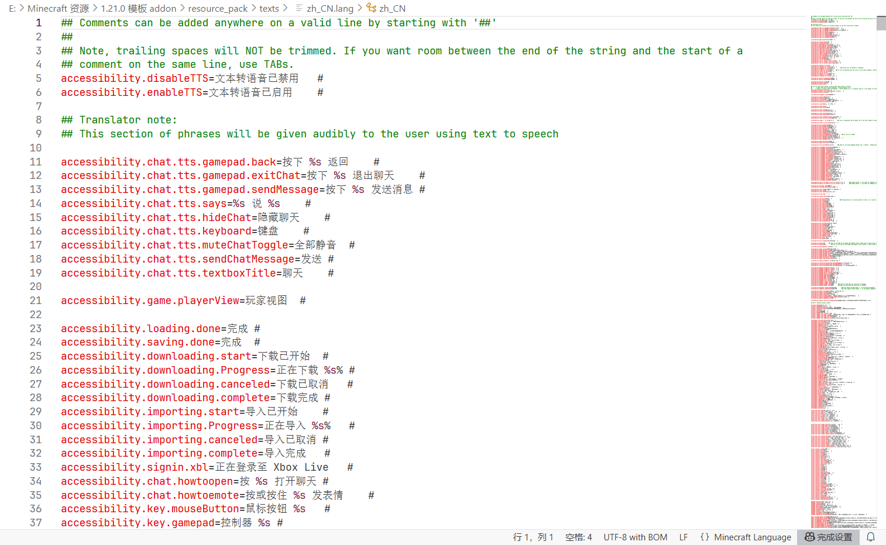

我们来看语言文件的结构，虽然内容极多，多达万行，但总体上讲语言文件的结构还是很简单的，主要由如下方面组成：
<!-- markdownlint-disable MD010 -->

- **键值对**：采用`key=value`的形式，代表`key`应该翻译为`value`。  
  例如上图第 5 行的`accessibility.disableTTS=文本转语音已禁用`。
- **注释**：由`##`（至少 2 个`#`）开头的行，这些行不会被 Minecraft 读取，因此可以写入辅助开发者理解的内容。  
  例如上图第 1 行的`## Comments can be added anywhere on a valid line by starting with '##'`。
- **键值对后注释**：标记在键值对后方的注释，这种注释习惯上应和键值对之间连接一个制表符`	`。  
  例如上图第 5 行的`accessibility.disableTTS=文本转语音已禁用	#`。

在这么多行的语言文件之中，如何找到自己想要的那个翻译？我们有几种方法可以快速定位到我们要找的键名或翻译。

1. **使用<kbd>Ctrl</kbd>+<kbd>F</kbd>启用搜索替换**，例如我们要搜索苹果的翻译，就在搜索栏中搜索“苹果”，VSC 会自动帮我们定位。其他的文本编辑器理论上也都支持搜索替换功能，要灵活运用。  
    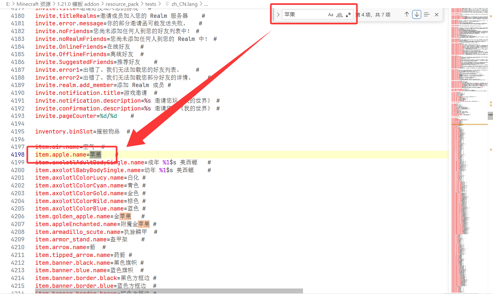
2. **通过键名格式定位翻译**。事实上键名都是具有高度的规律性的，例如，仔细观察物品的翻译键名，我们看到都是`item.(物品 ID).name`的格式，所以我们只需要搜索物品 ID 便能快速查到我们需要的键名。  
    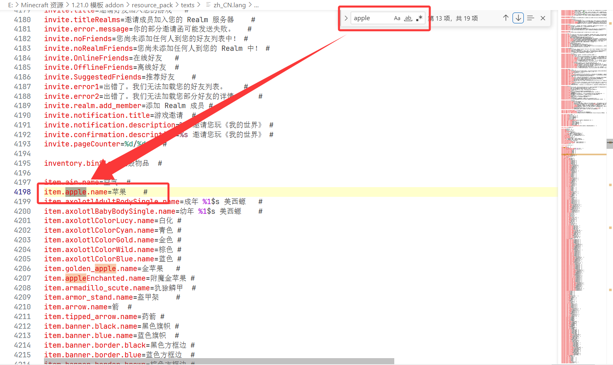
    通常来说，物品、方块、实体的键名是最常用的，它们的格式通常分别是`item.(物品 ID).name`、`tile.(方块 ID).name`（注意不是`block`）、`entity.(实体 ID).name`。在后面的数驱物品、方块、实体中，我们还会看到这一点，也会看到这些键名的另一种格式。

如果读者使用 VSC 的插件，会发现语言文件在**键重复**的情况下会报错，键值对和注释之间**未用制表符**（比如多个空格）连接也会报错。

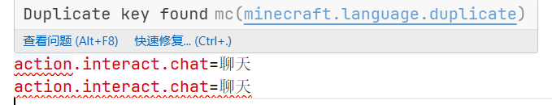
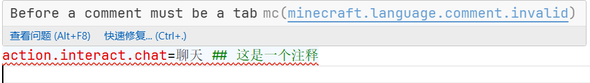

读者可以借此规范化自己的语言文件，如果错误太多的情况下也可以用以前讲过的方法忽略错误。

:::note[扩展：官方的文件就一定标准吗？]

有些开发者始终有这样的一种“执念”，仿佛官方给出的所有内容都是标准的。

然而，在附加包编程领域，我们要打破这种执念。官方给出的代码并不一定就是质量最高的，如果按照官方自己给出的原则，注释间用制表符（Tab）而非空格、注释以`##`开头的话，那么官方给出的语言文件全篇都是不标准的代码，因为他们的每一行末尾给出的都是一个`#`而不是两个`#`，属于自己都没有执行自己定下的标准。而且，如果细心一些会发现官方也会给出重复键名（虽然 10000 多行的文件有少量重复也在所难免）。

在后面，还会发现官方给出的文档不全、文档混乱、JSON 文件缩进混乱等诸多问题。就看看基岩版翻译的质量，读者便能马上理解。

然而，官方的文件和文档依然是我们编写附加包的重要参考，因为虽然文件文档并不标准，但是不影响正常使用，很多原版实例都是我们能用得到的，只是我们在编写过程中也要力求标准化规范化，增强代码的可读性，也是为了我们自己编写方便着想。

:::

## 实例：让基岩版的译名标准化

众所周知，基岩版苦非标准译名久矣。因为微软将中文翻译业务外包，加上外包团队极其不负责任的态度导致了基岩版如今灾难般的翻译。例如“避雷针”翻译成“雷霆之杖”，“悦灵”翻译成“小安粒”，更古早的版本中这种乱象还更严重。

靠官方是靠不住的，只能靠我们自己了！现在，按照引导来应用我们的语言文件更改：

1. 在**我们的资源包**中新增<FileType type="folder" name="texts" />文件夹，在文件夹内新增文件<FileType type="file" name="zh_CN.lang" />。
2. 在**模板包**中找到对应键名，例如找到“雷霆之杖”，获得它对应的键名`tile.lightning_rod.name`。  
    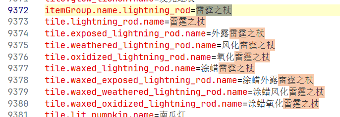  
    备注：*这个翻译是在 Preview 1.21.110.26 的模板包中找到的，随着铜器时代更新，新增加了多种避雷针。然而，本来在 1.21.0 时期就已经改好了的避雷针翻译，在这个版本居然又倒退了回来！果然靠官方靠不住吧……*
3. 将键名复制到我们新增的文件中，后面用等号连接正确的译名。
    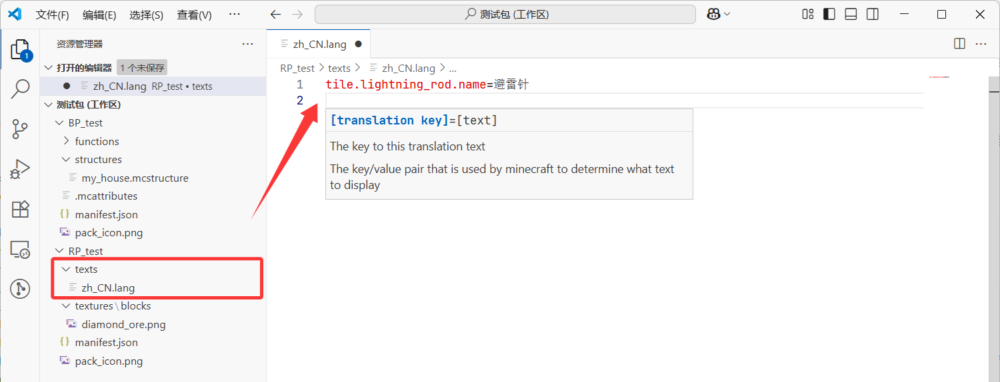  

这样就大功告成了！要注意，**应用语言文件的更改无需复制全部的语言文件，那样会大量地浪费空间，也不利于我们后续更改**，我们只要将需要更改的键名复制过来即可。

事实上，社区已有这样的译名标准化项目，而且是中文 Minecraft Wiki 官方牵头进行的项目，有需要的读者可以自行在 [GitHub](https://github.com/ff98sha/mclangcn) 或 [苦力怕论坛](https://klpbbs.com/thread-137794-1-1.html) 等下载。

## 实例：让我们将恶搞更进一步！

我们在前两节时曾经在思考 3.1 中过把钻石矿的贴图改成石头，读者是否还有印象？现在，我们要“以假乱真”——直接把钻石矿的名字也改成石头！

有了上一个实例做引导，实现这一点也并非难事。我们在模板中找到钻石矿对应的键名：

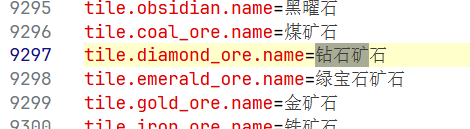

将这个键名`tile.diamond_ore.name`复制到我们的包中，改名为石头，再把贴图复制过来，大功告成！

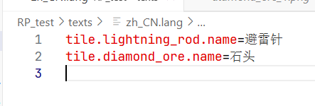  
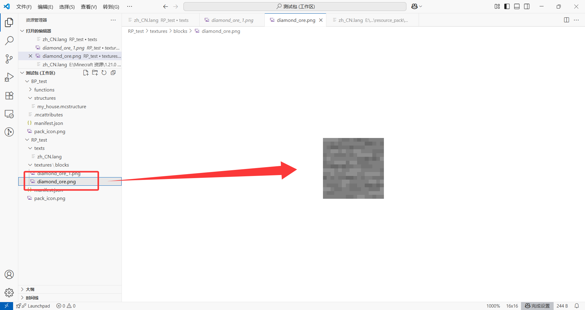

<!-- markdownlint-disable MD036 -->

*~~拿着石镐的朋友：诶这游戏是不是出bug了？（~~*

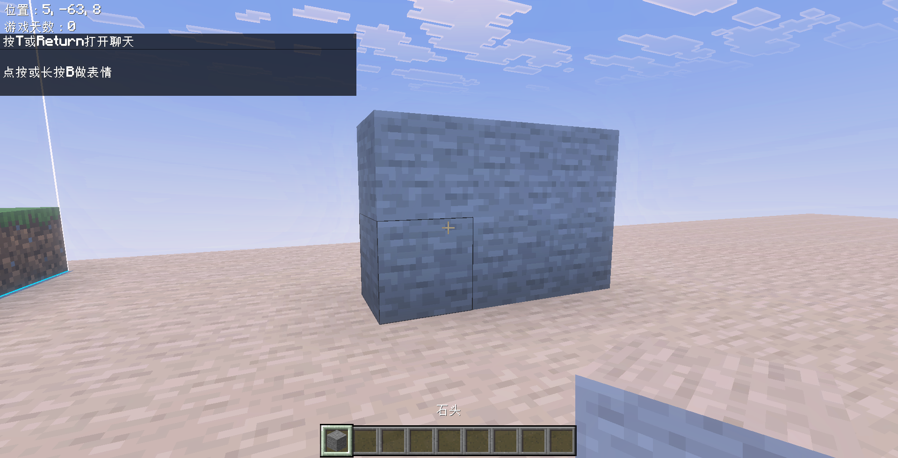  
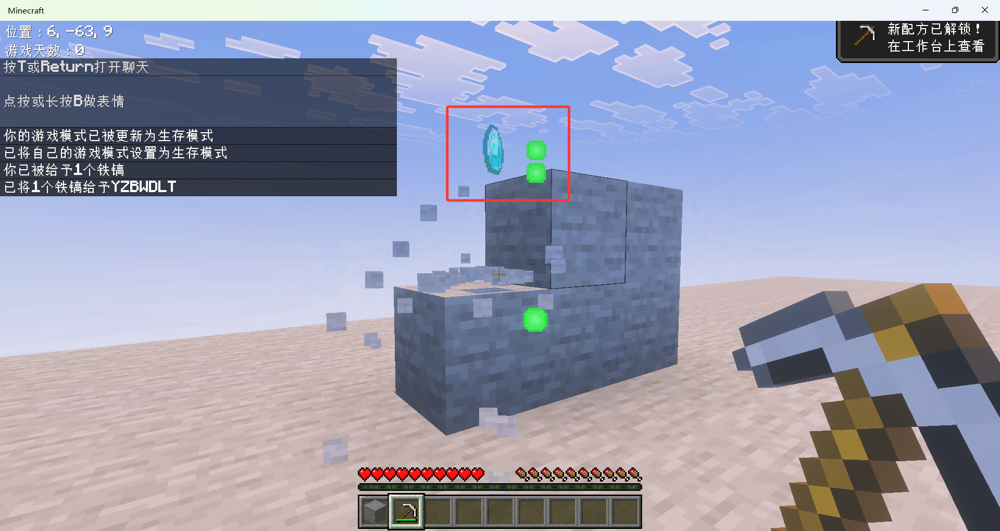

## 在命令`/tellraw`和`/titleraw`中语言文件的应用

我们在[命令部分](/docs/tutorials/a1_commands/b2_commands/c9_effect_cmds/d1_text_cmds#翻译组件translate与with)曾经讲过`translate`文本组件，当时我们曾说：

> 翻译组件能够输出语言文件的键名对应的值、或是进行文本格式化处理。可能你目前还没看懂这两个东西是干什么用的，这很正常。
>
> 对于语言文件，目前我们没什么值得多说的，不是因为它不重要（它其实很重要），而是因为这东西对于普通的命令玩家来说实在是已经超纲了。在模块 2，你就会看到语言文件`*.lang`的用途。

现在，相信读者已经基本了解了我们当时所写的命令的用法。也就是说，**`translate`还可以将语言文件中的键自动输出为对应的翻译**。这对于多语言资源创作者来说是很友好的，有一些地图就是利用语言文件进行的多语言适配。

我们来随便试一个语言文件中的键名，例如第 3686 行的这个：

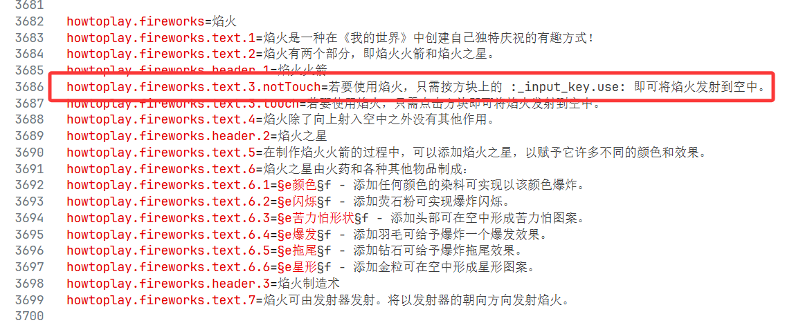  

在游戏内使用`/tellraw @s {"rawtext":[{"translate":"howtoplay.fireworks.text.3.notTouch"}]}`就是这样表现的：

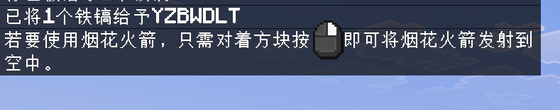  

*备注：我这里安装了 Wiki 的标准译名包，所以内容会有些不同*。

如果要联合`with`使用时，**我们使用`%s`来格式化**，例如众所周知的玩家进入游戏：

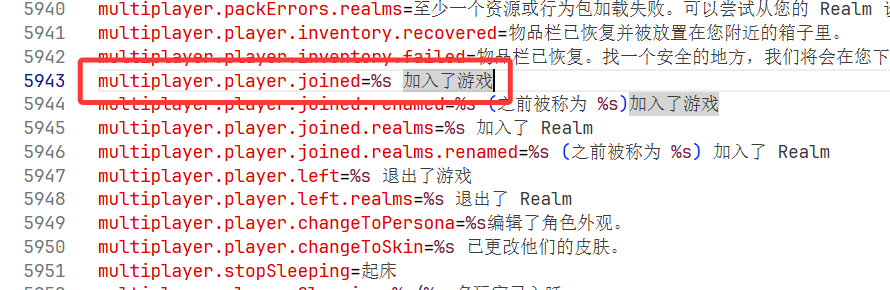  

其中，这里的`%s`就相当于我们当时讲的`%%s`。这样，我们在写命令时就可以不写成

```text
/tellraw @s {"rawtext":[{"translate":"§eYZBWDLT 加入了游戏"}]}
```

而是

```text
/tellraw @s {"rawtext":[{"translate":"multiplayer.player.joined","with":["§eYZBWDLT"]}]}
```

这样就能一条命令适配多语言下的进入游戏了。

我们也可以自己添加键名，例如：

```mclanguage text="zh_CN.lang" {4}
tile.lightning_rod.name=避雷针
tile.diamond_ore.name=石头

text.your_score=§b你的分数是 %s ！

```

然后**小退**应用你的更改，将命令写为

```text
/tellraw @s {"rawtext":[{"translate":"text.your_score","with":["10"]}]}
```

在游戏中的实际效果就为

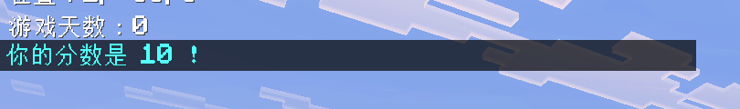  

怎么样，很简单吧？

## *更多的语言类型：以梗体中文为实例

你应该听说过社区曾经有一款梗体中文吧？如果没听说过，它是一款能够让你的游戏翻译变得很难绷的一个语言包。我们可以在[茶馆工作室的官网](https://meme.teahouse.team/)下载这款梗体中文。让我们先来看看它的效果：

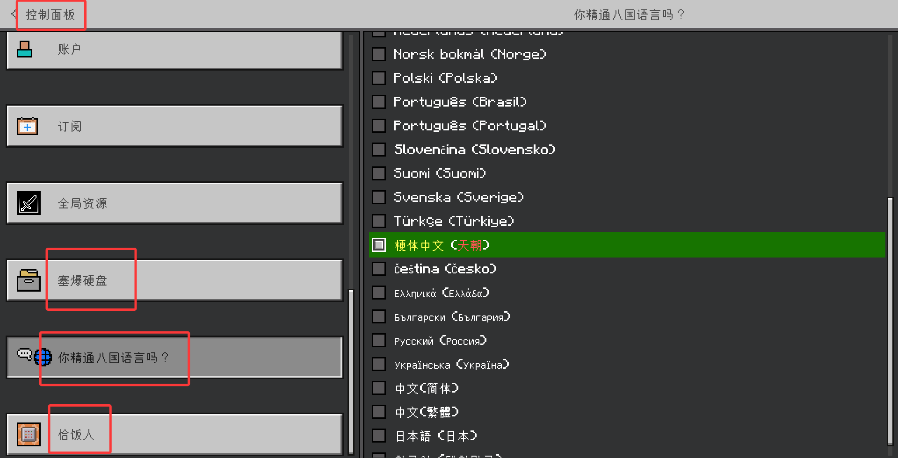  
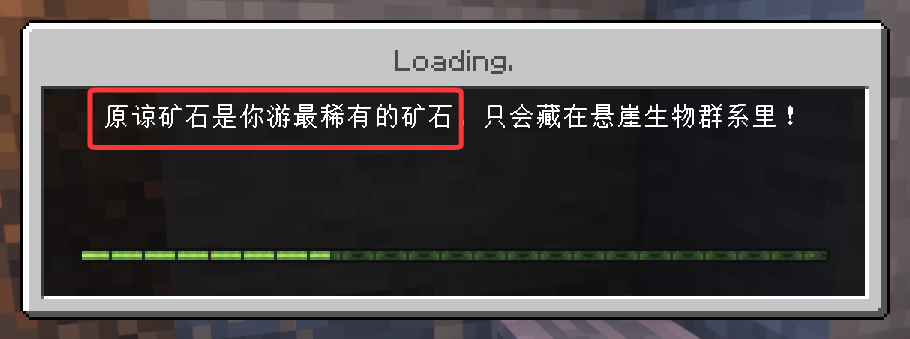  
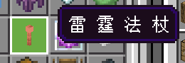  
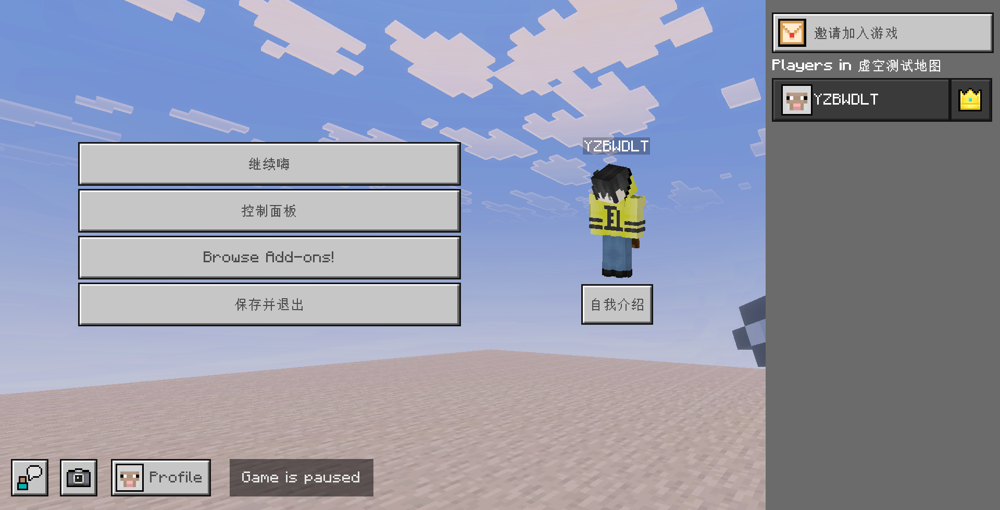  

很难绷，对吧？我们在图 1 展示出这是一个完全独立于中文（简体）的语言，它是如何实现的呢？

我们首先下载这个包。进入他们的官网后，一步步按照图中所示的参数下载包：

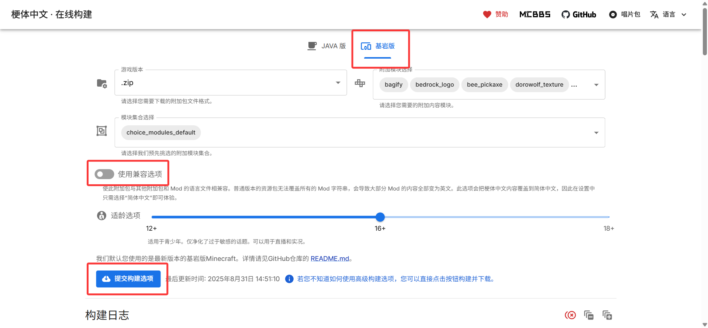  

下载好后通过压缩包打开这个附加包并解压，我们就能发现它的“奥妙”。

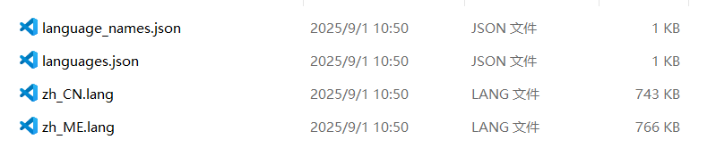  

事实上 Mojang 官方给出的模板包中我们也能看到<FileType type="file" name="languages.json" />和<FileType type="file" name="language_names.json" />，它们分别**用于注册语言**，和**给注册的语言一个语言名字**。观察官方给出的这两个文件的架构，不难发现两个文件应该符合这样的 Json 架构：

<treeview>

- <FileType type="file" name="languages.json" />：进行语言注册
  - <DataType type="array" />：根数组，表示可用的语言，游戏会自动寻找列出的语言为名称的`.lang`文件
    - <DataType type="string" />：语言 ID，例如`zh_CN`
- <FileType type="file" name="language_names.json" />：在游戏设置内声明语言名称
  - <DataType type="array" />：根数组，表示可用的语言 ID 对应的名称
    - <DataType type="string" name="0" />：语言 ID，例如`zh_CN`
    - <DataType type="string" name="1" />：语言名称，例如`中文(简体)`

</treeview>

所以，梗体中文就是分别定义了下面的语言 ID 和语言名称：

```json title="languages.json"
[
  "zh_CN",
  "zh_ME"
]
```

```json title="language_names.json"
[
  [
    "zh_ME",
    "§e梗体中文§r (§c天朝§r)"
  ]
]
```

然后，创建了一个新文件`zh_ME.lang`（正常情况下是不支持这个名字的，但是已经注册过后就可以支持），在里面写满了难绷的翻译。

这样做有优点，优点是不占用原有的语言文件，自己可以单独开出一个新的语言；但缺点也很明显，也很多：

1. 没有覆盖到的翻译就会默认采用英语（美国）的翻译了；
2. 游戏内在一般情况下也不能更改语言；
3. 受第 2 点的影响，这种包的通用性必须局限在全局资源上，而不能应用于特定地图；
4. 大多数模组也不会对这种新语言做单独适配（已有的语言都不一定会适配呢）；

所以，是否要单独开出一门语言是要进行取舍的。这也是梗体中文官网的“使用兼容选项”的意义，虽然占用了简体中文的翻译，但至少大多数情况下都是正常地显示中文。

---

## 总结

本节我们介绍了语言文件。事实上，这一章的内容，也就是贴图和翻译，都是为后面做铺垫，我们在第四到六章就要开始全面应用这些内容，所以读者应当对此了如指掌，以防我们在讲到相关内容时感到无所适从。现在我们来总结一下本节的内容吧！

- 语言文件是用于在不同语言下启用不同翻译的文件，放在资源包的<FileType type="folder" name="texts" />文件夹中，以.lang为后缀。
- 常用的语言文件主要是英语（美国）的翻译<FileType type="file" name="en_US.lang" />和简体中文（中国）的翻译<FileType type="file" name="zh_CN.lang" />。
- 语言文件以`key=value`的格式声明某个键名的翻译。使用`%s`来格式化。
- 语言文件以`##`的格式声明注释，注释行不会被读取。和函数不同，注释可以跟在翻译文本之后，但应以一个制表符分隔。
- 查找翻译也有很多方法可用。通常使用Ctrl+F来查找翻译，也可以使用特定的键名格式来查找翻译。
- 在对原版翻译进行更改时，应只写上要更改的键名，而不是把原版的 10000 多行的语言文件整体照搬（除非这 10000 多行都得到了更改）。
- 在命令`/tellraw`和`/titleraw`中，使用`translate`文本组件搭配键名以应用翻译。这也是命令系统中多语言化的一种重要手段。

## 练习

:::info[练习 3.2]

1. 试着将命令方块矿车的翻译改为“带有命令块的《我的世界》”。倒反天罡！
2. 试着更正几个 Minecraft 基岩版的错误翻译，并在游戏内应用。
3. 试搭配语言文件写一条命令，当玩家使用英语时输出“Hello,world!”，而使用中文时输出“你好，世界！”。

:::

<details>

<summary>练习题答案</summary>

1. ```mclanguage title="zh_CN.lang" showLineNumbers
   entity.command_block_minecart.name=带有命令块的《我的世界》
   item.command_block_minecart.name=带有命令块的《我的世界》
   ```

2. 答案略。

3. ```mclanguage title="zh_CN.lang" showLineNumbers
   text.hello_world=你好，世界！
   ```

   ```mclanguage title="en_US.lang" showLineNumbers
   text.hello_world=Hello,world!
   ```

   在游戏内输入命令：

   ```mcfunction
   /tellraw @s {"rawtext":[{"translate":"text.hello_world"}]}
   ```

</details>

import GiscusComment from "/src/components/comment/giscus.js"

<GiscusComment/>
